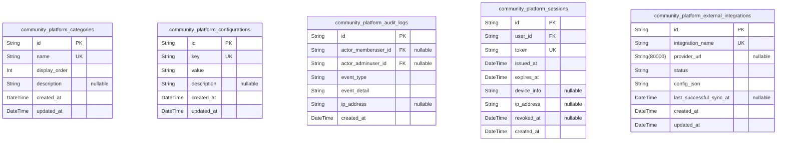
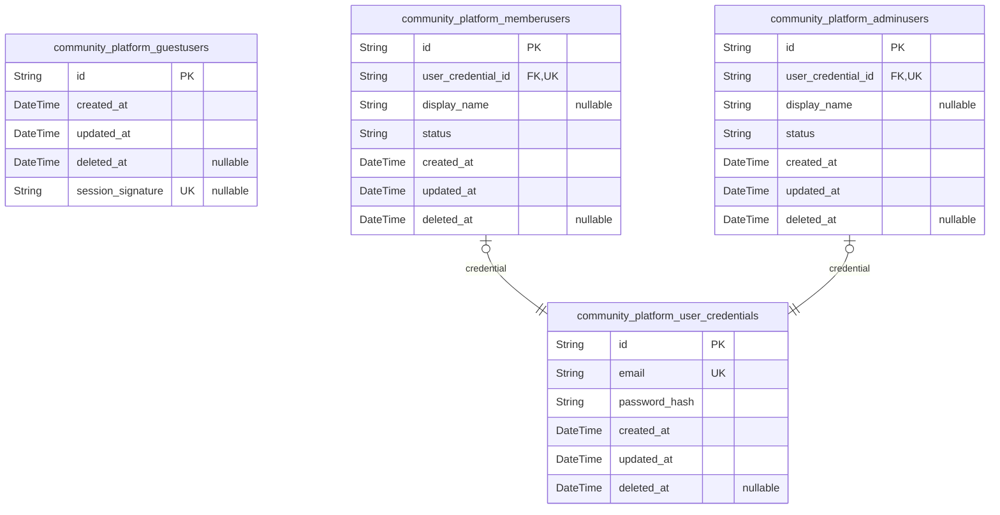
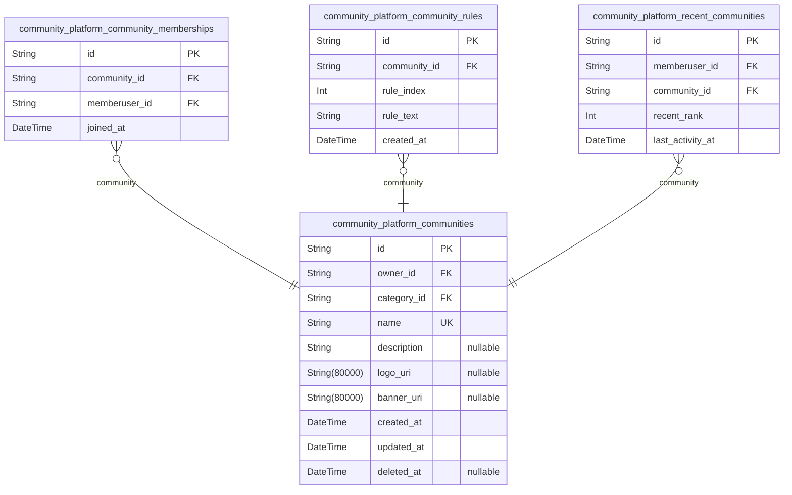
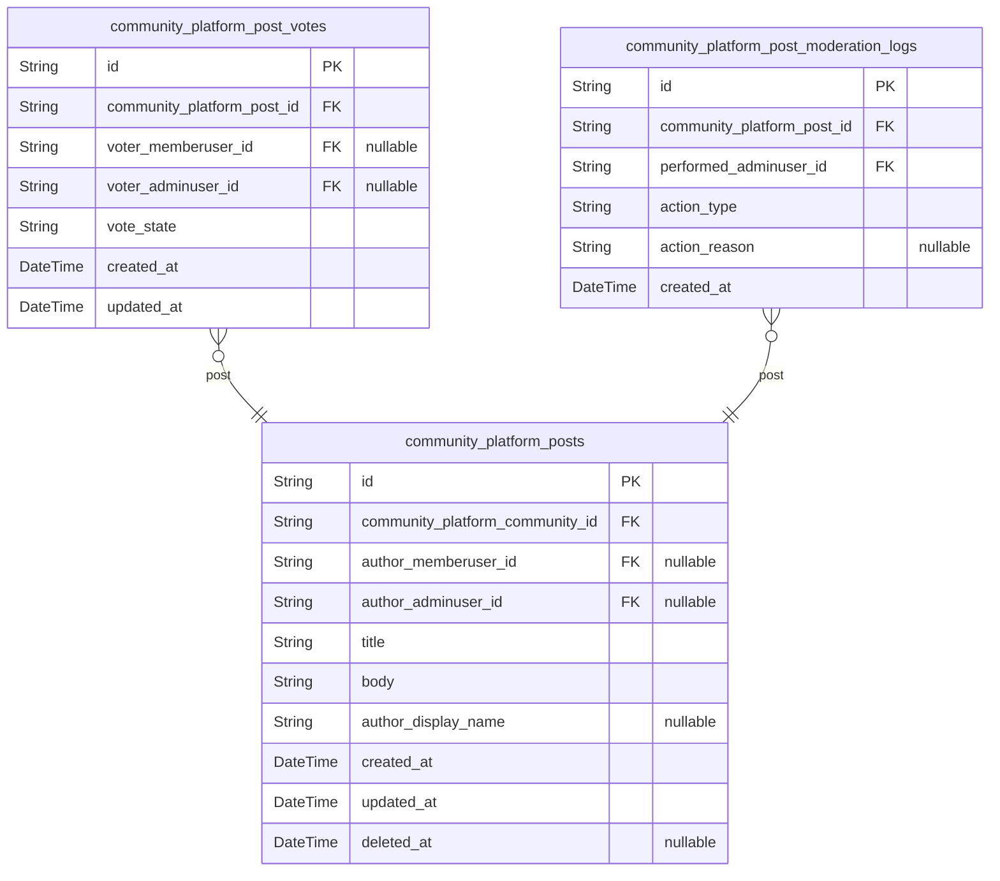
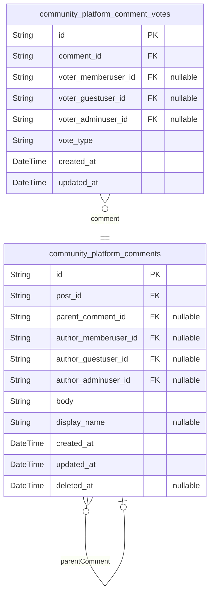
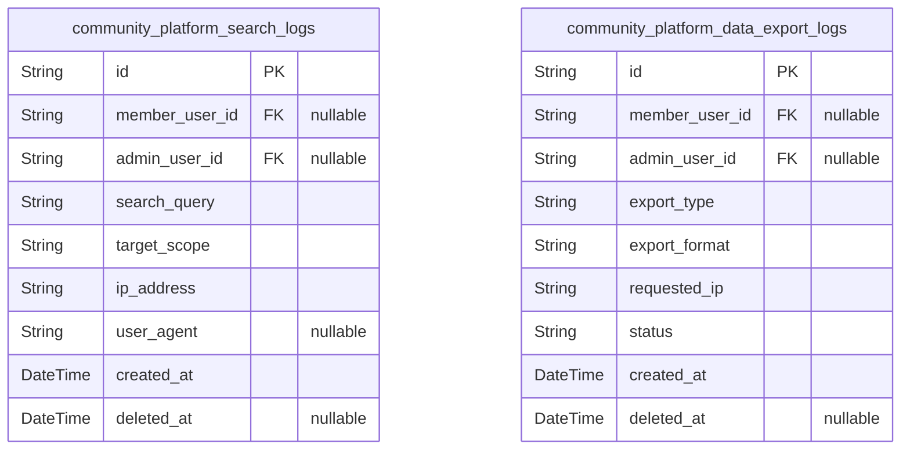

# Prisma Markdown

> Generated by [`prisma-markdown`](https://github.com/samchon/prisma-markdown)

- [Systematic](#systematic)
- [Actors](#actors)
- [Communities](#communities)
- [Posts](#posts)
- [Comments](#comments)
- [Analytics](#analytics)

## Systematic

### `community_platform_categories`

Defines allowable sub-community categories across the platform. Each
category is referenced by community creation, enforcing business
constraints and search classification. Name is case-insensitive unique
and immutable after creation. Serves as a lookup for category selectors
throughout the platform.

Properties as follows:

- `id`: Primary Key.
- `name`
  > Unique name of the category. Used for business logic and search
  > classification. Must be case-insensitive unique, 5-32 characters,
  > alphanumeric, hyphens and underscores allowed.
- `display_order`
  > Order for display in lists and UI selectors. Sequential integer starting
  > from 1.
- `description`
  > Optional description of the category for tooltips or context. Maximum 200
  > characters.
- `created_at`: Timestamp when category was created.
- `updated_at`: Timestamp when category record was last updated.

### `community_platform_configurations`

Stores global system configuration parameters, feature toggles, and
environment-level settings for the whole platform. Keys must be unique
and are referenced by application server logic. Auditability of changes
is critical (tracked via updated_at).

Properties as follows:

- `id`: Primary Key.
- `key`
  > Unique key name for the configuration parameter (e.g., 'max_post_length',
  > 'enable_voting', etc.).
- `value`
  > Parameter value as interpreted by application (arbitrary, can be JSON,
  > string, or number as string).
- `description`
  > Description of what this configuration controls and its effect. Max 200
  > chars for admin and logging context.
- `created_at`: Timestamp when configuration entry was created.
- `updated_at`: Timestamp of last update to value or description.

### `community_platform_audit_logs`

Platform-wide audit log covering sensitive actions, admin operations,
configuration changes, login events, and other system-critical
activities. Used for compliance review and security tracking. Logs
reference affected user or admin by id (nullable for system events).

Properties as follows:

- `id`: Primary Key.
- `actor_memberuser_id`
  > Optional reference to [community_platform_memberusers.id](#community_platform_memberusers) who
  > initiated the event, if applicable.
- `actor_adminuser_id`
  > Optional reference to [community_platform_adminusers.id](#community_platform_adminusers) who
  > initiated the event, if applicable.
- `event_type`
  > Type of audit event (e.g., 'config_change', 'session_login',
  > 'community_delete').
- `event_detail`
  > Detailed text or JSON describing the event context and any data changed
  > (suitable for security review, up to 1000 chars).
- `ip_address`
  > Originating IP address (for security tracing, IPv4 or IPv6, may be
  > empty/null for automated/system events).
- `created_at`
  > Timestamp of log event creation. Audit trails require immutable time
  > records.

### `community_platform_sessions`

Stores all platform-issued JWT or OAuth session tokens and associated
metadata for all users. Each session tracks issue and expiry, IP/device
info, and status. Data is used for login management, concurrent device
enforcement, and forced logout tracing.

Properties as follows:

- `id`: Primary Key.
- `user_id`
  > ID of the user (references any member/admin/guest as appropriate, must be
  > found in user tables). Flexible to support all user types.
- `token`
  > Issued secure session token (not stored in plaintext). Used as reference
  > for session retrieval/invalidation. Unique per session.
- `issued_at`: Session issuance timestamp.
- `expires_at`: Session expiry timestamp.
- `device_info`
  > Information about the user's device/browser at login (user agent or
  > structured JSON string for security analysis).
- `ip_address`: Login IP address at session creation (for audit/security logic).
- `revoked_at`: If non-null, session was manually revoked before expiry.
- `created_at`: Timestamp of session DB record creation.

### `community_platform_external_integrations`

Administrative registry of authorized third-party API integrations for
the platform, including OAuth providers, webhooks, or external systems
allowed to access or receive events from the platform. Used for
configuration, monitoring, and management of all integrations.

Properties as follows:

- `id`: Primary Key.
- `integration_name`
  > Unique name for this integration (e.g., 'GoogleOAuth', 'SendGrid',
  > 'Webhook-Analytics').
- `provider_url`: Base URL for the third-party integration endpoint.
- `status`
  > Operational status of integration: enabled, disabled, error, pending
  > setup.
- `config_json`
  > JSON configuration payload for the integration (credentials, required
  > scopes, etc.). Sensitive, restrict access to admins.
- `last_successful_sync_at`
  > Timestamp of last confirmed event or handshake from this integration (for
  > monitoring health/status).
- `created_at`: Timestamp when this integration entry was created.
- `updated_at`: Timestamp of last update to integration details/configuration.

## Actors

### `community_platform_guestusers`

Defines unauthenticated guest user sessions tracked by the platform for
analytics and traceability. Records represent unique browser/device
interaction without user login. No personal identifying information is
stored. Used for session tracking and conversion analytics. Does not
allow credential linkage. Only referenced by system-side features and
events.

Properties as follows:

- `id`: Primary Key.
- `created_at`: Timestamp when this guest session was first recorded.
- `updated_at`: Timestamp when this guest session was last active.
- `deleted_at`: Timestamp for soft deletion. Null if active.
- `session_signature`
  > Opaque string used to link guest records to tracking or legitimate
  > metrics. Not a user identifier.

### `community_platform_memberusers`

Represents registered and authenticated platform users. Business entity
for content creation, voting, commenting, joining/leaving communities,
and owning posts or comments. Each member user is associated with
credentials (email/password login). May have display name, status, and is
auditable by created/updated timestamps. Linked to posts/comments by
foreign key in other business tables.

Properties as follows:

- `id`: Primary Key.
- `user_credential_id`
  > Reference to authenticated credentials {@link
  > community_platform_user_credentials.id}. Required for login and password
  > resets.
- `display_name`
  > Display name visible to others; 0–32 characters allowed. Optional, falls
  > back to 'Anonymous'.
- `status`
  > Account status for business logic (e.g., active, suspended,
  > pending_deletion).
- `created_at`: Timestamp when this user account was created.
- `updated_at`: Timestamp when this user account was last modified.
- `deleted_at`: Timestamp for soft deletion, or null if the account is active.

### `community_platform_adminusers`

Platform administrators with elevated privileges. Can perform system
moderation tasks, manage communities, delete any content, and change
site-wide configuration. Admin users are managed independently and
require their own credentials. May represent trusted staff or automated
service accounts. Status and audit timestamps apply. Must be created and
managed by other admins. Not convertible from member users.

Properties as follows:

- `id`: Primary Key.
- `user_credential_id`
  > Reference to credentials for login/authentication {@link
  > community_platform_user_credentials.id}.
- `display_name`: Admin display name. Optional field for UI display only.
- `status`: Admin status (e.g., active, suspended, retired).
- `created_at`: Timestamp when this admin account was created.
- `updated_at`: Timestamp of most recent admin info update.
- `deleted_at`: Timestamp for soft delete; null if the admin is active.

### `community_platform_user_credentials`

Authentication credential entity for both member and admin users. Stores
securely hashed password, unique email address, and management audit
fields. Audited for login activity and password reset security. Linked
via user_credential_id in member and admin users for 1:1 relationship.
Credentials are never exposed to non-privileged systems. Login
enforcement and user password reset flows enforced via this table.

Properties as follows:

- `id`: Primary Key.
- `email`
  > Unique email address for authentication. Case-insensitive match. Used for
  > login and password reset flows.
- `password_hash`
  > Securely stored hash of user password (bcrypt or Argon2). Never the plain
  > text, even to internal logic.
- `created_at`: Timestamp when credentials were created. Used for audit trail.
- `updated_at`: Timestamp when credentials were last changed (e.g., password reset).
- `deleted_at`: Timestamp when credentials were deleted/invalidated. Null if still valid.

## Communities

### `community_platform_communities`

Table representing sub-communities within the platform. Each row stores
metadata and configuration for a single community: unique name, category
reference, description, visual assets (logo/banner), and rules (via
subsidiary table). The owner is an immutable reference to the user who
created the community. Only owners may update metadata except for
deletion, which may be performed by admin. Business constraints enforce
unique and valid names. Categories are referenced from
community_platform_categories. Supports full-text search on name and
description via GIN indexes. Deletion is soft (deleted_at).

Properties as follows:

- `id`: Primary Key.
- `owner_id`
  > Creator of the community. References {@link
  > community_platform_memberusers.id}.
- `category_id`
  > Category for this community. References {@link
  > community_platform_categories.id}.
- `name`
  > Unique, case-insensitive name of the community (5-32 chars, a-zA-Z0-9-_).
  > Immutable once set. Used as public identifier.
- `description`: Optional community description, up to 200 characters.
- `logo_uri`: Optional URI for community logo/image asset.
- `banner_uri`: Optional URI for community banner image asset.
- `created_at`: Timestamp this community was created.
- `updated_at`: Timestamp of the most recent metadata update.
- `deleted_at`: Timestamp marking soft deletion, or null if active.

### `community_platform_community_memberships`

Table representing the many-to-many relationship between users and
communities. Each record marks the fact that a user is a joined member of
a given community. Used for membership enforcement, home feed
personalization, and recent communities logic. Entries may be created or
removed by users directly. Uniqueness enforced on (user, community).
Supports joined time and auditing.

Properties as follows:

- `id`: Primary Key.
- `community_id`: Joined community reference. [community_platform_communities.id](#community_platform_communities).
- `memberuser_id`
  > User that joined this community. {@link
  > community_platform_memberusers.id}.
- `joined_at`: Timestamp when user joined this community.

### `community_platform_community_rules`

Stores the set of numbered rules for each community, used for
informational and business constraint display. Each rule is a text string
up to business limit; rules are always associated with a particular
community. Managed only through community settings flows, not directly by
end users. Deleting a community cascades deletion of its rules. Ordering
is enforced per-community with rule_index.

Properties as follows:

- `id`: Primary Key.
- `community_id`: Parent community for this rule. [community_platform_communities.id](#community_platform_communities).
- `rule_index`: Order of this rule in display (starts at 1, max 10 per community).
- `rule_text`: Content for the community rule (max 100 characters).
- `created_at`: Timestamp rule was added.

### `community_platform_recent_communities`

Records the recent community navigation/activity for a member user, to
power personalized sidebars and navigation. Each entry links a user and a
community, with a recency ordering (recent_rank) and last_activity_at
timestamp. Not a membership table—distinct from
platform_community_memberships. Used for fast access/recall UI, managed
automatically by system logic. Max 5 recent communities per user enforced
via unique index.

Properties as follows:

- `id`: Primary Key.
- `memberuser_id`
  > User who recently navigated to a community. {@link
  > community_platform_memberusers.id}.
- `community_id`: Recently visited community. [community_platform_communities.id](#community_platform_communities).
- `recent_rank`
  > Rank/order of this community in recent navigation for this user (lower =
  > more recent, max 5 per user).
- `last_activity_at`: Timestamp this community was last visited by user.

## Posts

### `community_platform_posts`

Posts table storing all primary content items (threads, questions, etc.).
Contains title and body, references to community and author, and temporal
fields for auditing. Supports soft delete for business rule compliance.
Each post must reference a valid community and author (either member or
admin). Used for feed queries, full-text search, and direct management by
users. Related entities include [community_platform_communities](#community_platform_communities)
for the containing group and [community_platform_memberusers](#community_platform_memberusers) or
[community_platform_adminusers](#community_platform_adminusers) for authorship.

Properties as follows:

- `id`: Primary Key.
- `community_platform_community_id`
  > Belonged community's [community_platform_communities.id](#community_platform_communities). Required
  > for enforcing post ownership to a specific community.
- `author_memberuser_id`
  > Authored member user's [community_platform_memberusers.id](#community_platform_memberusers). Exactly
  > one of author_memberuser_id or author_adminuser_id must be set. Used when
  > the post author is a regular member user.
- `author_adminuser_id`
  > Authored admin user's [community_platform_adminusers.id](#community_platform_adminusers). Exactly
  > one of author_memberuser_id or author_adminuser_id must be set. Used when
  > the post author is an admin user.
- `title`
  > Post title. Must be between 5 and 120 characters as enforced by business
  > rules.
- `body`
  > Post body content. Must be between 10 to 10,000 characters. Plain text
  > with only line breaks allowed.
- `author_display_name`
  > Optional author display name (0–32 chars). Displays 'Anonymous' if empty
  > as per system rule.
- `created_at`: Creation timestamp of the post.
- `updated_at`: Last updated timestamp of the post.
- `deleted_at`
  > Soft deletion timestamp. Null if not deleted, otherwise indicates
  > deletion time.

### `community_platform_post_votes`

Supporting table capturing voting state (upvote, downvote, none) for each
user and post. Only one row exists per user+post combination. Used for
aggregator queries on score calculation for posts and enforcing
one-vote-per-user logic. Foreign keys reference {@link
community_platform_posts}, [community_platform_memberusers](#community_platform_memberusers), and
[community_platform_adminusers](#community_platform_adminusers).

Properties as follows:

- `id`: Primary Key.
- `community_platform_post_id`: Related post's [community_platform_posts.id](#community_platform_posts).
- `voter_memberuser_id`
  > Voting member user's [community_platform_memberusers.id](#community_platform_memberusers). One of
  > voter_memberuser_id or voter_adminuser_id must be set.
- `voter_adminuser_id`
  > Voting admin user's [community_platform_adminusers.id](#community_platform_adminusers). One of
  > voter_memberuser_id or voter_adminuser_id must be set.
- `vote_state`
  > Vote state for post by user: 'upvote', 'downvote', or 'none'. Only one
  > allowed per post per user. Null indicates an explicit removal (optional
  > for soft deleted votes).
- `created_at`: Vote creation timestamp.
- `updated_at`: Vote last updated timestamp (toggle logic).

### `community_platform_post_moderation_logs`

Table recording moderation actions on posts (edit, delete, restore, etc.)
for legal/accountability compliance. Each event is linked to a post,
performed by an admin user, and stores the action type, reason, and
timestamp. Used for audit trails and recovery/business rule enforcement.
Related to [community_platform_posts](#community_platform_posts) and {@link
community_platform_adminusers}.

Properties as follows:

- `id`: Primary Key.
- `community_platform_post_id`: Target post's [community_platform_posts.id](#community_platform_posts).
- `performed_adminuser_id`
  > Admin user performing the moderation action {@link
  > community_platform_adminusers.id}.
- `action_type`: Moderation action type (e.g., 'edit', 'delete', 'restore').
- `action_reason`: Explanation/reason provided for moderation action. Up to 255 chars.
- `created_at`: Timestamp of the moderation event.

## Comments

### `community_platform_comments`

Represents a comment on a post in the community platform. Supports
arbitrary nesting via self-reference for threaded replies
(parent_comment_id). Each comment is authored by a user, and may
reference either a member, guest, or admin user ID, and is always
associated to a specific post. Comments can be top-level (no
parent_comment_id) or replies (parent_comment_id set). Moderation and
access controls are enforced at the application. All standard text and
length validation is application-enforced. Deletion is soft (deleted_at).

Properties as follows:

- `id`: Primary Key.
- `post_id`
  > The post this comment belongs to. References {@link
  > community_platform_posts.id}.
- `parent_comment_id`
  > The parent comment for nested replies. References {@link
  > community_platform_comments.id}. Null for top-level comments.
- `author_memberuser_id`
  > The member user who authored this comment. References {@link
  > community_platform_memberusers.id}. Null unless the comment was made by a
  > member user.
- `author_guestuser_id`
  > The guest user who authored this comment. References {@link
  > community_platform_guestusers.id}. Null unless the comment was made by a
  > guest user.
- `author_adminuser_id`
  > The admin user who authored this comment. References {@link
  > community_platform_adminusers.id}. Null unless the comment was made by an
  > admin user.
- `body`
  > The body content of the comment, plain text, 2–2,000 characters.
  > Validation is application-enforced.
- `display_name`
  > Optional author display name for this comment (0–32 characters). Uses
  > "Anonymous" if empty per platform rules.
- `created_at`: Timestamp when the comment was created.
- `updated_at`: Timestamp when the comment was last updated.
- `deleted_at`: Soft delete: Timestamp when the comment was deleted, null if not deleted.

### `community_platform_comment_votes`

Tracks per-user vote state for each comment. Each record represents the
current vote (upvote, downvote, or none) by a single user (can be member,
guest, or admin) on a given comment. Maximum of one vote state per (user,
comment) pair is enforced. Cannot be used to vote on own comment,
enforced by application. Used to calculate comment scores.

Properties as follows:

- `id`: Primary Key.
- `comment_id`
  > The comment this vote is associated with. References {@link
  > community_platform_comments.id}.
- `voter_memberuser_id`
  > The member user who cast the vote. References {@link
  > community_platform_memberusers.id}. Null unless vote by a member user.
- `voter_guestuser_id`
  > The guest user who cast the vote. References {@link
  > community_platform_guestusers.id}. Null unless vote by a guest user.
- `voter_adminuser_id`
  > The admin user who cast the vote. References {@link
  > community_platform_adminusers.id}. Null unless vote by an admin user.
- `vote_type`
  > Vote state: must be one of 'upvote', 'downvote', or 'none'. Business
  > logic ensures at most one vote per user/comment.
- `created_at`: Timestamp when the vote was created.
- `updated_at`: Timestamp when the vote was last updated.

## Analytics

### `community_platform_search_logs`

Search action logs for the community platform. Records user and admin
search actions including IP, search query, target scope, and timestamps
for analytics, data export compliance, and trend analysis. Supports
tracking search activity for personalizing experiences and fulfilling
compliance audits like GDPR data searches. Links to member/admin user by
foreign key (may be null—for some anonymous system-level logs), and to IP
address for security monitoring.

Properties as follows:

- `id`: Primary Key.
- `member_user_id`
  > Performed member user's [community_platform_memberusers.id](#community_platform_memberusers). May be
  > null for non-authenticated or system-driven logs.
- `admin_user_id`
  > Performed admin user's [community_platform_adminusers.id](#community_platform_adminusers). Null
  > unless the search was performed by an admin.
- `search_query`
  > The text of the search query issued by the user or admin. Used for
  > analytics and service improvement.
- `target_scope`
  > The logical scope of the search, such as 'posts', 'comments', or
  > 'communities'. Used for analytic and UI behavioral breakdowns.
- `ip_address`
  > The user or system IP address from which the search was performed. Used
  > for audit/security review and geo-distribution analytics.
- `user_agent`
  > HTTP user-agent string for device/browser analytics. Helps track
  > session/device fingerprints and trends.
- `created_at`: Timestamp when this search log entry was created.
- `deleted_at`
  > Soft-delete timestamp (nullable). Included for compliance with data
  > retention/deletion policies.

### `community_platform_data_export_logs`

Logs system/export data requests for compliance and admin audit. Tracks
when a member or admin requests a downloadable data export (e.g.,
personal data, posts, or community details), including which user/admin
made the request, what type of data was requested, export format, and
time. Useful for legal compliance (GDPR/CCPA) and admin oversight of all
access to large-scale data exports. Links to both member and admin users
(nullable depending on actor), and includes plain fields for event
context.

Properties as follows:

- `id`: Primary Key.
- `member_user_id`
  > Requesting member user's [community_platform_memberusers.id](#community_platform_memberusers). May
  > be null if export was triggered by admin-only action or on behalf of a
  > user by admin.
- `admin_user_id`
  > Requesting admin user's [community_platform_adminusers.id](#community_platform_adminusers). May be
  > null if request was performed by a member only.
- `export_type`
  > The nature of the export (e.g., 'user_data', 'community_data', 'posts',
  > etc.). Used for compliance tracking and analytics.
- `export_format`: File format of the export ('json', 'csv', etc.). Used in analytics/audit.
- `requested_ip`
  > IP address from which the export was requested. For audit trail,
  > security, and compliance.
- `status`
  > Status of the export request (e.g., 'pending', 'completed', 'failed').
  > Used for operational monitoring.
- `created_at`: Timestamp when the export request was made.
- `deleted_at`
  > Soft-delete timestamp (nullable). Included for GDPR/policy-driven removal
  > or process clean-up.
