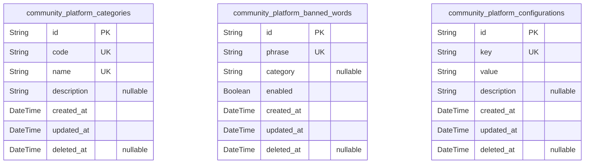
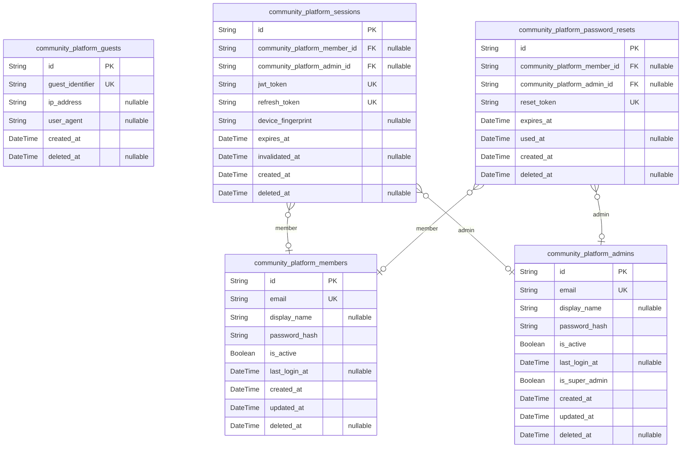
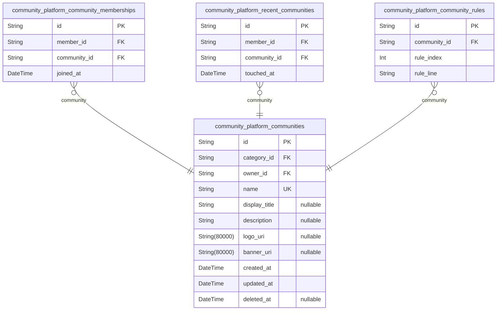
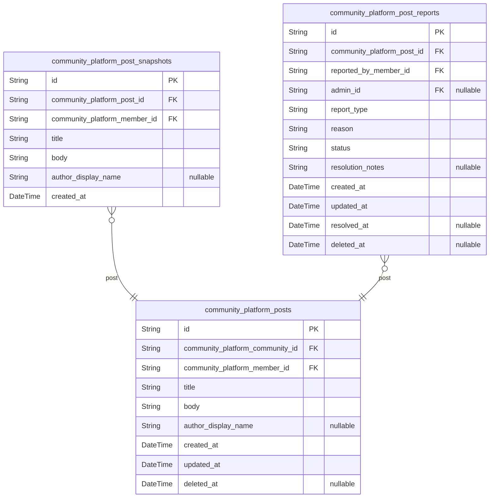
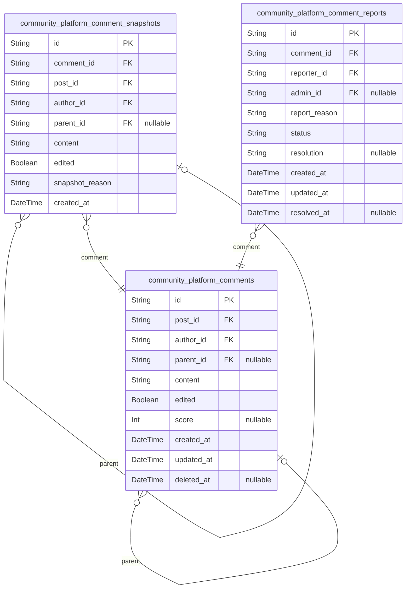
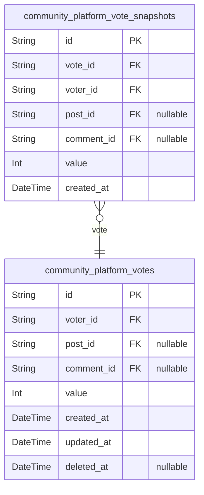
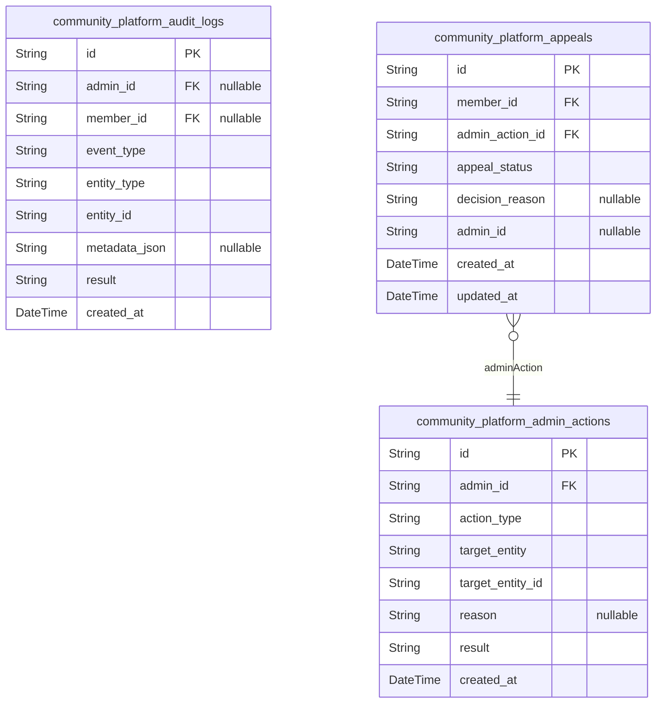
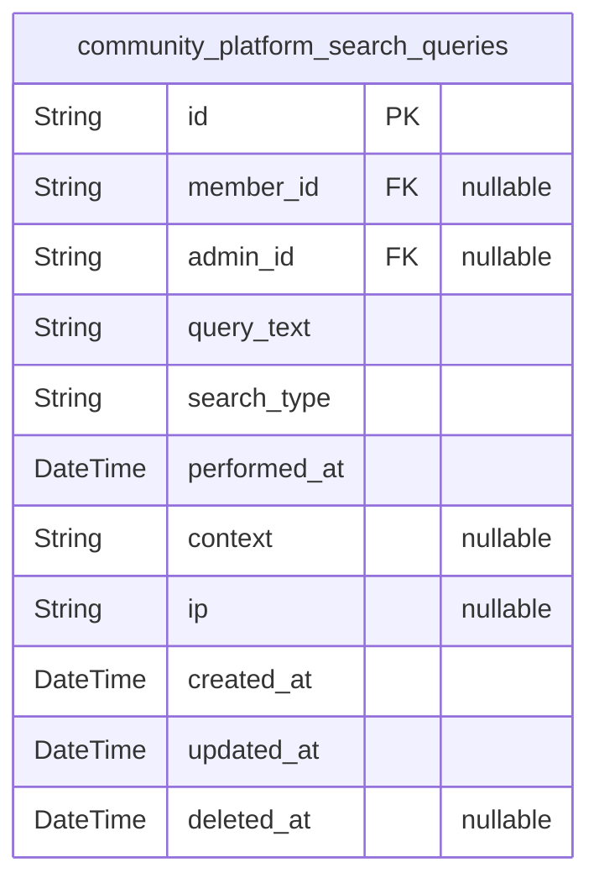
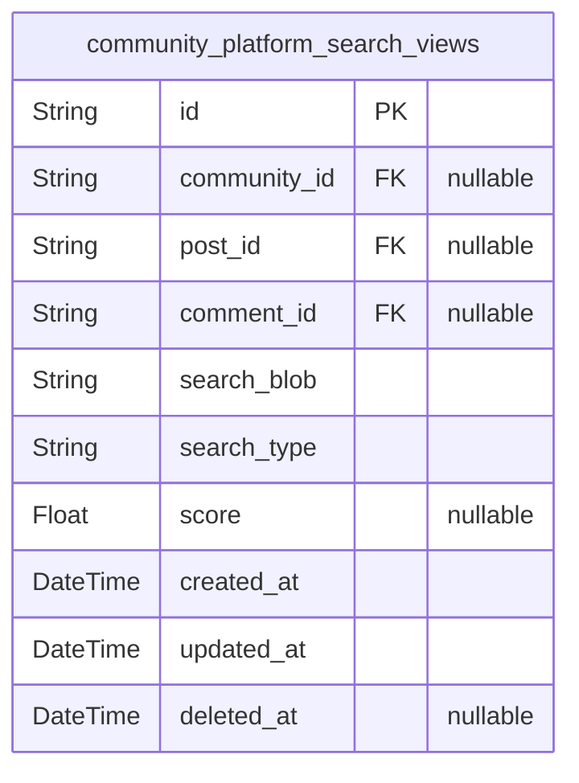

# Prisma Markdown

> Generated by [`prisma-markdown`](https://github.com/samchon/prisma-markdown)

- [Systematic](#systematic)
- [Identity](#identity)
- [Communities](#communities)
- [Posts](#posts)
- [Comments](#comments)
- [Votes](#votes)
- [Moderation](#moderation)
- [Search](#search)
- [default](#default)

## Systematic

### `community_platform_categories`

Master table for community category definitions. This model stores the
allowed set of categories that a sub-community can belong to, such as
'Tech & Programming', 'Science', etc. Each community must reference a
valid category from this table. Enables system-wide normalization of
category selection and allows for category auditing, restriction, and
business reporting. Frequently referenced by {@link
community_platform_communities}.

Properties as follows:

- `id`: Primary Key.
- `code`
  > Unique string code for the category (typically slug form, e.g.,
  > 'tech_programming'). Used for programmatic references and API lookups.
  > Must be unique.
- `name`
  > Human-readable display name for the category (e.g., 'Tech &
  > Programming'). Required for display in UI and selection lists.
- `description`
  > Optional long-form category description (up to 200 characters), for
  > tooltips or additional UI context.
- `created_at`: Timestamp when the category was created.
- `updated_at`: Timestamp when the category was last updated.
- `deleted_at`
  > Timestamp marking soft deletion of the category. Null if active. Provides
  > audit support for category lifecycle.

### `community_platform_banned_words`

System-wide banned words list for content moderation. Each row represents
a single word or phrase that is not permitted in posts, comments,
community names, and other user-generated content. Enables robust
moderation by providing a centrally managed, independently updatable
dictionary outside of main content flows. List is referenced by
moderation engines and can be maintained by trusted moderators/admins.

Properties as follows:

- `id`: Primary Key.
- `phrase`
  > Banned word or phrase. Used for case-insensitive content validation and
  > moderation sweeps. Must be unique across list.
- `category`
  > Optional category or severity flag for this phrase (e.g.,
  > 'profanity','spam','hate'). Enables fine-grained filtering and reporting.
- `enabled`
  > Indicates whether the banned word/phrase is currently active and
  > enforced. Allows for temporary deactivation without deletion.
- `created_at`: Timestamp when this banned word/phrase was added to the list.
- `updated_at`: Timestamp when the phrase was last modified (e.g., edit or re-enabled).
- `deleted_at`
  > Timestamp marking soft deletion/removal from enforcement. Null if still
  > active. Supports audit trails for moderation history.

### `community_platform_configurations`

Centralized storage for system-level configuration parameters and
business logic switches (e.g., toggling maintenance mode, updating UI
settings, adjusting moderation thresholds). This table allows flexible
addition of named configuration entries by administrators, supporting
runtime system adjustments without code deploys. Accessible and
independently managed by trusted admins. May be referenced throughout
business logic for behavioral branching.

Properties as follows:

- `id`: Primary Key.
- `key`
  > Unique string key representing the configuration parameter (e.g.,
  > 'maintenance_mode', 'max_post_length'). All config lookups are based on
  > this key. Must be unique.
- `value`
  > The raw configuration value (typically serialized as text, which may be
  > JSON, number, string, or feature flag). Must be interpreted at the
  > business logic layer per config key type.
- `description`: Description of the configuration setting for admin UI/reference.
- `created_at`: Timestamp when this configuration was created.
- `updated_at`: Timestamp when the configuration was last updated.
- `deleted_at`
  > Timestamp marking soft deletion/lifecycle end of the configuration. Null
  > if active. Enables auditability for config changes.

## Identity

### `community_platform_guests`

Guest/anonymous visitor audit entity. Stores analytics and audit trail
data for non-authenticated users (guests) who browse the platform before
sign-up or login. Used to track activity, unique identifiers (e.g.,
cookie or device), and optional metadata for analytics purposes. Not
managed directly by any user. Not linked to business content entities
such as posts or communities. Cascade deletion is not required. Only
subsidiary, not intended for API endpoints beyond analytics/audit log
queries.

Properties as follows:

- `id`: Primary Key.
- `guest_identifier`
  > Pseudonymous analytics identifier for the guest (e.g., cookie/session ID
  > or device fingerprint).
- `ip_address`
  > IP address of the guest at session creation, for anonymized tracking and
  > abuse mitigation.
- `user_agent`: User agent or browser/device fingerprint string for analytics.
- `created_at`: Entity creation timestamp (when first seen).
- `deleted_at`: Soft delete timestamp (nullable when active).

### `community_platform_members`

Registered member identity table. Stores all account, authentication, and
profile data for regular users who sign up, log in, and perform
interactive actions on the platform. Directly managed by member-facing
APIs (sign-up, update, password change, delete, etc.). Has strong unique
email constraint and separate hashed password. May be linked to sessions,
password resets, and community content through FKs from other tables.
Members may be promoted to admin via a separate admin entity (not
polymorphic).

Properties as follows:

- `id`: Primary Key.
- `email`
  > Login email address, unique and required for account. Used as the main
  > authentication identifier.
- `display_name`
  > Optional display name (shown as post/comment author); if not set,
  > defaults to 'Anonymous'. Max 32 chars.
- `password_hash`
  > Hashed password value (never raw password). Required for logins, must
  > conform to secure algorithm (e.g., bcrypt, argon2).
- `is_active`
  > Whether the member account is currently active (not banned/deleted/locked
  > for security).
- `last_login_at`
  > Timestamp of last successful login for this member. Allows multi-device
  > logins to update independently.
- `created_at`: Timestamp of account creation.
- `updated_at`
  > Timestamp of last account update. Must be updated on profile or
  > credential change.
- `deleted_at`
  > Soft-deletion timestamp. Null if active, set when deleted for business
  > audit trail.

### `community_platform_admins`

Administrative user entity. Stores privileged user accounts with full
moderation rights and system-level access. Not polymorphic with members;
admin accounts are managed separately for rigorous privilege control,
auditability, and rollback of admin actions. Includes unique email,
password hash (distinct from member), privilege metadata, and suspension
state. Directly managed via dedicated admin APIs. All admin actions are
fully audited in other tables. Cascade deletion/banning disables admin
access, not member (and vice versa).

Properties as follows:

- `id`: Primary Key.
- `email`
  > Login email address for admin account. Uniquely identifies admin login;
  > separate from member email uniqueness constraint.
- `display_name`
  > Formal name for admin, displayed in audit logs, notifications, and
  > moderation actions.
- `password_hash`
  > Secure hash of admin password. Used only for admin role logins, separate
  > from member hashes.
- `is_active`
  > Account active status; false disables all admin login/privilege. Admin
  > status is not inherited from member.
- `last_login_at`: Date and time of last authenticated admin login.
- `is_super_admin`
  > Whether this admin account has super-admin privileges (can manage other
  > admins, system policies, etc.).
- `created_at`: Account creation timestamp.
- `updated_at`: Timestamp of last admin account update.
- `deleted_at`: Soft deletion timestamp for audit trail; null if active.

### `community_platform_sessions`

Session token management entity. Stores all active and expired JWT
sessions for both members and admins. Enables multi-device,
multi-platform logins per user. Tracks refresh token, expiration,
device/client fingerprint, and invalidation state. Holds references to
either a member or admin (never both, always at least one). Soft
deletion/invalidation removes session access without removing audit
trail. Used for 'log out everywhere' and session review features.
User-facing APIs allow reviewing and invalidating own sessions.

Properties as follows:

- `id`: Primary Key.
- `community_platform_member_id`
  > Belonged member's [community_platform_members.id](#community_platform_members) if session is for
  > a member. Nullable when session belongs to admin.
- `community_platform_admin_id`
  > Belonged admin's [community_platform_admins.id](#community_platform_admins) if session is for
  > an admin. Nullable for member sessions.
- `jwt_token`
  > Issued JWT token string (access or refresh). Used for session validation
  > and revocation. Uniquely identifies the session on this device/browser.
- `refresh_token`
  > Refresh token (if issued). Required for session renewal logic,
  > invalidated upon logout or expiry.
- `device_fingerprint`
  > Device/browser fingerprint for this session. Used to help identify
  > physical device or client type.
- `expires_at`: When the session (token) will expire and become invalid.
- `invalidated_at`
  > If set, indicates time of forced session invalidation (logout everywhere,
  > password reset, etc.).
- `created_at`: Timestamp of session creation/signup or fresh login.
- `deleted_at`: Soft deletion timestamp for audit trail. Null if still valid/visible.

### `community_platform_password_resets`

Password reset request entity. Stores secure password reset tokens and
request audit trails for both member and admin accounts. Controls reset
workflow, expiration, and repeat/reset cooldown logic. References either
a member or admin, with exclusive constraint that only one of the two is
set for each row. Resets can be invalidated as part of security flow.
Used by forgot password workflows and reset email handling. APIs do not
allow direct row manipulation except via password reset flows.

Properties as follows:

- `id`: Primary Key.
- `community_platform_member_id`
  > Targeted member's [community_platform_members.id](#community_platform_members) for whose
  > password is being reset. Nullable if admin.
- `community_platform_admin_id`
  > Targeted admin's [community_platform_admins.id](#community_platform_admins) for whose password
  > is being reset. Nullable if member.
- `reset_token`
  > One-time use password reset token, emailed to user and valid for single
  > use. Must be cryptographically random, unique, and securely generated.
  > Used to identify/reset process.
- `expires_at`
  > Expiration timestamp for the reset token. After this, resets are rejected
  > until a new request is made.
- `used_at`: Timestamp when token was used and password updated. Null if unused.
- `created_at`: Timestamp of password reset request creation.
- `deleted_at`: Soft deletion timestamp; for audit only, not for API use.

## Communities

### `community_platform_communities`

Main sub-community entity. Represents each named, top-level discussion
group (sub-community) on the platform. Contains immutable name (unique,
alphanumeric, hyphen/underscore), category (FK), owner/creator (FK),
description, logo/banner URIs, created_at/updated_at timestamps, and
optional community-wide rules. Supports unique name constraint and
category covariates. Directly managed (create/read/update/delete) by
users and admins. Referenced by memberships, rules, and posts. {@link
community_platform_community_memberships}, {@link
community_platform_community_rules}.

Properties as follows:

- `id`: Primary Key.
- `category_id`: Category reference. [community_platform_categories.id](#community_platform_categories).
- `owner_id`: Owner/creator reference. [community_platform_members.id](#community_platform_members).
- `name`
  > Immutable, unique, human-readable community name. 3-32 characters,
  > alphanumeric, hyphen, underscore. Uniqueness enforced case-insensitively.
  > Not editable after creation.
- `display_title`
  > Optional display title of the community. Up to 64 characters. Editable by
  > owner or admin.
- `description`: Optional summary description for the community, up to 200 characters.
- `logo_uri`: Optional URI for the community's logo image. Max 5MB.
- `banner_uri`: Optional URI for the community's banner image. Max 5MB.
- `created_at`: Timestamp: when the community was created.
- `updated_at`: Timestamp: when the community was last updated.
- `deleted_at`: Timestamp: when the community was soft-deleted, else null.

### `community_platform_community_memberships`

Junction table tracking many-to-many membership between users and
communities. Records each join event. Used to determine who has joined
which community for personalized feeds, permissions, and UI state. Does
not contain historic membership (no history retention on leave).
Existence of a row means current active membership. Composite unique
constraint ensures user can join a community only once. Members and
communities are both referenced. [community_platform_members.id](#community_platform_members),
[community_platform_communities.id](#community_platform_communities).

Properties as follows:

- `id`: Primary Key.
- `member_id`: Member reference (user who joins). [community_platform_members.id](#community_platform_members).
- `community_id`: Community being joined. [community_platform_communities.id](#community_platform_communities).
- `joined_at`
  > Timestamp when member joined community. Joining is always explicit user
  > action; no implicit or historic membership tracking.

### `community_platform_recent_communities`

Tracks the recency of each member's interaction with communities (e.g.,
for sidebar 'recent communities' UI). Serves as a many-to-many support
junction, records most recent visit or activity to a community by each
member. Not a full audit trail, nor a membership log. Ensures for each
(member, community) the most recent row is retained. Managed for UI
purposes, not historical record. Composite member/community unique index.
[community_platform_members.id](#community_platform_members), {@link
community_platform_communities.id}.

Properties as follows:

- `id`: Primary Key.
- `member_id`: Member reference. [community_platform_members.id](#community_platform_members).
- `community_id`: Community reference. [community_platform_communities.id](#community_platform_communities).
- `touched_at`
  > Timestamp when this member last visited/engaged with this community.
  > Updated on every user interaction that should update recency UI state.

### `community_platform_community_rules`

Stores each community's optional multi-line rules (up to 10 lines, each
up to 50 characters). Exists only in context of a parent community. Each
row is a single rule line, foreign-keyed to community. Editable by
community owner and admins only. Managed together with the parent
community and not independently. Enforces 3NF and flexible rule
management. [community_platform_communities.id](#community_platform_communities).

Properties as follows:

- `id`: Primary Key.
- `community_id`
  > Community to which this rule belongs. {@link
  > community_platform_communities.id}.
- `rule_index`
  > Order of rule line (0-based, must be between 0–9; max 10 rules per
  > community enforced at app level).
- `rule_line`: Single rule line (max 50 characters, no linebreaks).

## Posts

### `community_platform_posts`

Stores all posts (threads) created by authenticated members within
communities. Each post belongs to a sub-community and has an author
(member), supports edits (versioned via post_snapshots), and is
referenced by comments, votes, and reports. Core entity enabling
personalized feeds, search, and moderation. Snapshots preserve edit
history. Deletion cascades to comments and votes. Foreign keys link to
[community_platform_communities](#community_platform_communities), {@link
community_platform_members}.

Properties as follows:

- `id`: Primary Key.
- `community_platform_community_id`
  > Belonged community's [community_platform_communities.id](#community_platform_communities). Each post
  > is always tied to a specific community.
- `community_platform_member_id`
  > Author member's [community_platform_members.id](#community_platform_members). References the
  > creator/author of the post.
- `title`: Post title. Must be 5–120 chars, plain text. Used for search/discovery.
- `body`
  > Post content body. Plain text, 10–10,000 chars. No code or scripts
  > allowed.
- `author_display_name`
  > Optional display name to override default. If null, use 'Anonymous' or
  > profile default. Up to 32 chars.
- `created_at`: Post creation timestamp.
- `updated_at`: Post last edit/update timestamp.
- `deleted_at`: Soft-deleted timestamp. Null if active. Used for soft delete.

### `community_platform_post_snapshots`

Point-in-time snapshots for each revision of a post for audit trail,
rollback, and edit/version history. Every update to a post creates an
append-only record here, preserving the full prior state. Supports
moderation review and compliance audits. References the post,
author/member at snapshot time. Not user-editable. Foreign keys to {@link
community_platform_posts}, [community_platform_members](#community_platform_members).

Properties as follows:

- `id`: Primary Key.
- `community_platform_post_id`: Original post's [community_platform_posts.id](#community_platform_posts).
- `community_platform_member_id`
  > Author member's [community_platform_members.id](#community_platform_members). The member
  > associated with this snapshot (may match original author or modifier).
- `title`: Snapshot of the post's title at this version.
- `body`: Snapshot of the post's body at this version.
- `author_display_name`
  > Snapshot of display name (may be null for anonymous/default in that
  > version).
- `created_at`: Snapshot creation (edit) time. Immutable.

### `community_platform_post_reports`

Reports filed by members or admins for moderation actions against posts
(spam, abuse, rules violation, etc). Enables workflow for review,
escalation, and tracking. Each report references the target post, the
reporting member, and optionally the admin handler. Includes type,
reason, status, and resolution fields. Drives moderation/appeals
lifecycle. Linked to [community_platform_posts](#community_platform_posts), {@link
community_platform_members}, and [community_platform_admins](#community_platform_admins).

Properties as follows:

- `id`: Primary Key.
- `community_platform_post_id`
  > Target post's [community_platform_posts.id](#community_platform_posts). The post that was
  > reported.
- `reported_by_member_id`
  > Reporting member's [community_platform_members.id](#community_platform_members). The user who
  > created the report.
- `admin_id`
  > Admin's [community_platform_admins.id](#community_platform_admins) who handled or resolved this
  > report. Nullable until assigned.
- `report_type`: Type/category of report (e.g. spam, abuse, offtopic, moderation, other).
- `reason`
  > Detailed reason or user-entered explanation of report. Business rules:
  > plain text, up to 1000 characters. Searchable field.
- `status`
  > Current report status (e.g. open, resolved, dismissed). Drives moderation
  > queue/workflow.
- `resolution_notes`
  > Optional: notes or rationale by admin/moderator after handling. Null if
  > unresolved or unannotated.
- `created_at`: Creation (filing) time of report.
- `updated_at`: Time of last update or admin action.
- `resolved_at`: When report was resolved or closed. Null for open cases.
- `deleted_at`
  > Soft-delete timestamp; record remains for audit/logs after logical
  > deletion.

## Comments

### `community_platform_comments`

Primary business entity representing user-authored comments on posts.
Each comment may be a direct reply to a post (parent_id null) or a reply
to another comment (parent_id set), enabling recursive threading.
Comments are linked to posts (community_platform_posts), authored by a
member (community_platform_members), and support independent search,
edit, and moderation. Snapshots track version history (see {@link
community_platform_comment_snapshots}). Reports reference this entity for
abuse/moderation. Cascade deletion from posts and parent comments must be
enforced on application side.

Properties as follows:

- `id`: Primary Key.
- `post_id`: Belonged post's [community_platform_posts.id](#community_platform_posts).
- `author_id`: Comment author's [community_platform_members.id](#community_platform_members).
- `parent_id`
  > Parent comment's [community_platform_comments.id](#community_platform_comments). Nullable for
  > top-level comments.
- `content`: Comment text content (plain text, 2-2000 chars, no code/scripts).
- `edited`: Whether the comment has been edited after initial creation.
- `score`
  > Net vote score (upvotes minus downvotes); live recalculated, not stored
  > (for reference only). Business tables must not persist live scores.
- `created_at`: Timestamp of comment creation (UTC).
- `updated_at`: Timestamp of last modification (UTC).
- `deleted_at`
  > Null unless soft-deleted (when present, comment is considered deleted for
  > user-facing UIs).

### `community_platform_comment_snapshots`

Snapshot entity for immutable, historical records of state changes to
comments. Each snapshot preserves the full state of a comment at a moment
in time for audit, rollback, version control, or moderation. Linked to
original comment, capturing author, parent, post, content, edit state,
and timestamps. Append-only; no updates or deletions permitted. Utilized
for audit trails, abuse investigations, and trust/safety reporting.
Related to [community_platform_comments](#community_platform_comments).

Properties as follows:

- `id`: Primary Key.
- `comment_id`: Original comment's [community_platform_comments.id](#community_platform_comments).
- `post_id`
  > Referenced post's [community_platform_posts.id](#community_platform_posts) (captured at the
  > time of snapshot for historical linkage).
- `author_id`
  > Comment author's [community_platform_members.id](#community_platform_members) (historical copy;
  > author may change roles).
- `parent_id`
  > Parent comment snapshot's {@link
  > community_platform_comment_snapshots.id}. Nullable for top-level
  > snapshot.
- `content`: Full content of comment at snapshot time (plain text, up to 2000 chars).
- `edited`: Whether this version reflects an edit after original creation.
- `snapshot_reason`
  > Explanation/reason for this snapshot (e.g., initial, edit, moderation
  > action, abuse report, etc.).
- `created_at`: Timestamp when this snapshot was saved (UTC).

### `community_platform_comment_reports`

Primary business entity for user-initiated reports of inappropriate
comments. Contains references to the reported comment, the reporting user
(member), and includes reason, status, resolution, and timestamps for
moderation workflows. Used for actionable moderation flows, supporting
search across reports by status, reporter, and referenced comment. All
reports are reviewed by admins.

Properties as follows:

- `id`: Primary Key.
- `comment_id`: Reported comment's [community_platform_comments.id](#community_platform_comments).
- `reporter_id`: Reporting member's [community_platform_members.id](#community_platform_members).
- `admin_id`
  > Assigned admin's [community_platform_admins.id](#community_platform_admins) if report has been
  > escalated/assigned. Nullable until assigned.
- `report_reason`
  > Reporter-supplied reason/description for the report (plain text, 2-500
  > chars).
- `status`: Status of the report (e.g., pending, under_review, resolved, rejected).
- `resolution`: Resolution note or outcome determined by moderator/admin.
- `created_at`: Timestamp report was created (UTC).
- `updated_at`: Timestamp of last modification (UTC), e.g., status or resolution changed.
- `resolved_at`: Timestamp when report was resolved/closed. Nullable if still open.

## Votes

### `community_platform_votes`

Records each user's vote (upvote, downvote, or neutral) on either a post
or a comment. Each vote is uniquely defined per user and target (post or
comment); a user cannot vote more than once on a single post or comment,
and cannot vote on their own content (enforced in business logic, not in
schema). Either post or comment foreign key must be set (mutually
exclusive, never both). Deleting a target (post/comment) or voter
(member) cascades to delete votes. This model enables independent
creation, update, and removal of votes, supports audit and rollback via
snapshots ([community_platform_vote_snapshots](#community_platform_vote_snapshots)).

Properties as follows:

- `id`: Primary Key.
- `voter_id`: User (member) who cast the vote. [community_platform_members.id](#community_platform_members).
- `post_id`
  > Target post voted on (if this is a post vote). {@link
  > community_platform_posts.id}. Only one of post_id or comment_id is set
  > per vote. Null means not a post vote.
- `comment_id`
  > Target comment voted on (if this is a comment vote). {@link
  > community_platform_comments.id}. Only one of post_id or comment_id is set
  > per vote. Null means not a comment vote.
- `value`
  > Vote value: 1 for upvote, -1 for downvote, 0 for neutral (vote removal).
  > Only these values are valid. Enforced in application logic.
- `created_at`: Vote creation timestamp.
- `updated_at`: Vote modification timestamp.
- `deleted_at`
  > Vote soft-deletion timestamp. Null if not deleted; set if vote was
  > removed/deleted (soft delete).

### `community_platform_vote_snapshots`

Captures point-in-time historical states of individual votes for audit,
dispute, and rollback. Each record logs a single change event or version
for a vote (including on creation, modification, or deletion). Used for
compliance, recovery, and detailed audit trails. Each snapshot references
the vote it records and includes all original vote fields for complete
historical context.

Properties as follows:

- `id`: Primary Key.
- `vote_id`
  > Original vote tracked by this snapshot. {@link
  > community_platform_votes.id}.
- `voter_id`
  > User (member) who cast the original vote. Redundant from main votes table
  > for audit integrity. [community_platform_members.id](#community_platform_members).
- `post_id`
  > Target post (if the vote was for a post). Duplicates from vote; used for
  > full snapshot context. [community_platform_posts.id](#community_platform_posts).
- `comment_id`
  > Target comment (if the vote was for a comment). Duplicates from vote;
  > used for full snapshot context. [community_platform_comments.id](#community_platform_comments).
- `value`
  > Vote value at the time of the snapshot: 1 for upvote, -1 for downvote, 0
  > for neutral/removal.
- `created_at`: Snapshot creation timestamp.

## Moderation

### `community_platform_admin_actions`

Records all administrative actions performed by admins within the
platform, including create, delete, suspend, restore operations across
all major entities (communities, posts, comments, users). This provides a
full audit trail for moderation, enables accountability, and supports
moderation escalations and investigations. References both the admin
performing the action and the affected entity type and ID.

Properties as follows:

- `id`: Primary Key.
- `admin_id`
  > Admin user's [community_platform_admins.id](#community_platform_admins) who performed this
  > action.
- `action_type`
  > The type of moderation action taken (e.g., delete_post, suspend_user,
  > remove_comment, restore_community, ban_member). Always a single word or
  > snake_case identifier.
- `target_entity`
  > Entity type affected by this admin action (e.g., community, post,
  > comment, user, membership).
- `target_entity_id`
  > ID of the affected entity. Used for linking to the specific community,
  > post, comment, or user involved in the action.
- `reason`
  > Reason or rationale for the admin action as provided by the admin (e.g.,
  > spam, abusive behavior, ToS violation, appeal approval, etc).
- `result`
  > Outcome/result of the admin action (e.g., success, error, restored,
  > overridden).
- `created_at`: Timestamp when the admin action was performed.

### `community_platform_audit_logs`

Comprehensive append-only audit trail capturing all critical moderation,
escalation, and administrative actions for compliance and traceability.
Stores cross-entity context, responsible actors (admin/member), JSON
payloads of action metadata, and outcome. This table provides immutable
historical records for all business-sensitive moderation and admin
events. Used for forensic and regulatory processes.

Properties as follows:

- `id`: Primary Key.
- `admin_id`
  > Reference to the admin involved in this audit event. Can be null for
  > system-level or automated events. [community_platform_admins.id](#community_platform_admins)
- `member_id`
  > Reference to the member user involved in this audit event, if applicable.
  > Can be null if no member involved. [community_platform_members.id](#community_platform_members)
- `event_type`
  > Type of audit event (e.g., admin_action, system_appeal, policy_override,
  > escalation, data_access).
- `entity_type`
  > Impacted business entity (community, post, comment, user, appeal, vote,
  > etc).
- `entity_id`: ID of the entity involved in this audit event.
- `metadata_json`
  > Raw JSON string containing structured event metadata, parameters, and
  > contextual payload for audit review.
- `result`
  > Final result or status of this event (e.g., success, error, reverted,
  > escalated).
- `created_at`: Timestamp for when this audit log entry was recorded.

### `community_platform_appeals`

Stores user-initiated appeals and requests for review of moderation/admin
actions. Connects to the specific action or audit log being appealed,
tracks appeal status, decision, and communications between appellant
(member) and reviewing admin. Used for dispute resolution, process
accountability, and transparency.

Properties as follows:

- `id`: Primary Key.
- `member_id`
  > The member who is appealing the moderation/admin event. {@link
  > community_platform_members.id}
- `admin_action_id`
  > Reference to the admin action being appealed (may also be fulfilled from
  > audit logs if more granular trace is needed). {@link
  > community_platform_admin_actions.id}
- `appeal_status`
  > Status of the appeal (e.g., submitted, under_review, resolved, rejected,
  > reversed).
- `decision_reason`
  > Detailed decision rationale or explanation from the reviewing admin (or
  > automated process).
- `admin_id`
  > Admin who reviewed the appeal and made the decision, if already
  > processed. Null while pending. [community_platform_admins.id](#community_platform_admins)
- `created_at`: Timestamp when the appeal was created.
- `updated_at`
  > Timestamp of most recent status update or communication regarding the
  > appeal.

## Search

### `community_platform_search_queries`

Tracks every user search event, recording query string, performer (if
authenticated), context, and search type. Used for analytics, abuse
detection, personalization, and auditing. Linked to {@link
community_platform_members.id} or [community_platform_admins.id](#community_platform_admins) if
performed by authenticated users; for guests, performer may be null.
Critical for monitoring search trends and supporting account-linked query
history.

Properties as follows:

- `id`: Primary Key.
- `member_id`
  > Searcher’s [community_platform_members.id](#community_platform_members). Nullable; present if
  > search is performed by an authenticated member.
- `admin_id`
  > Searcher’s [community_platform_admins.id](#community_platform_admins). Nullable; present if
  > search is performed by an authenticated admin.
- `query_text`
  > Original user-entered search string. Supports full-text analysis and
  > personalization. Maximum length 2000 characters.
- `search_type`
  > Type of entity searched: 'post', 'community', or 'comment'. Used for
  > analytics and segmentation. Enum constraint enforced at application.
- `performed_at`
  > Timestamp when the search was performed. Enables time-bounded reports and
  > user context recreation.
- `context`
  > Search context or page (e.g. 'home', 'explore', 'sidebar'). Supports
  > analytics on entrypoints. Up to 64 chars. Optional.
- `ip`
  > IP address or anonymized token for audit/abuse detection. Optional,
  > usually recorded for guest or security analysis. Recommended max 128
  > chars.
- `created_at`: Record creation timestamp.
- `updated_at`: Last update timestamp for the search query record.
- `deleted_at`: Soft-deletion timestamp for GDPR/compliance. Null if not deleted.

## default

### `community_platform_search_views`

Materialized or denormalized search data to support fast search result
lookup, ranking, and analytics. Can include precomputed or indexed
content blobs for full-text search optimization, faceted filtering, and
result scoring. Not user-managed; refreshed by system jobs or triggers.
Aggregates and indexes content from other business tables for search
speed.

Properties as follows:

- `id`: Primary Key.
- `community_id`
  > Referenced community's [community_platform_communities.id](#community_platform_communities). Relates
  > aggregated search data to its community.
- `post_id`
  > Referenced post's [community_platform_posts.id](#community_platform_posts). Null if this row
  > aggregates a community or comment search index only.
- `comment_id`
  > Referenced comment's [community_platform_comments.id](#community_platform_comments). Populated
  > only for comment search index rows.
- `search_blob`
  > Precomputed, denormalized, or concatenated (title/body/author) content
  > for GIN/trigram search. Used for ultra-fast search matching.
- `search_type`
  > Indicates which entity this record indexes: 'post', 'community', or
  > 'comment'. Used to distinguish aggregated index type.
- `score`
  > Optional, system-maintained search ranking/relevance score for result
  > ordering. Can be null if not computed yet.
- `created_at`: Record creation timestamp.
- `updated_at`: Last update timestamp for this materialized view row.
- `deleted_at`: Soft-deletion timestamp for row lifecycle management. Null if not deleted.
