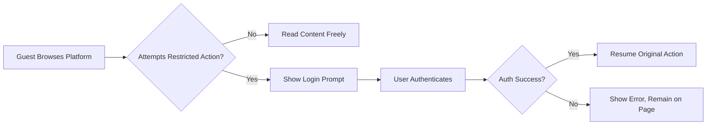

# Functional Requirements for Community Platform

## General Functional Requirements

- THE communityPlatform SHALL support creation, joining, leaving, searching, posting, commenting, and voting for all users, subject to their role permissions.
- THE communityPlatform SHALL make reading and browsing posts, communities, and comments available to all, including guests.
- THE communityPlatform SHALL require user authentication for any posting, commenting, voting, joining/leaving communities, and creating sub-communities.
- WHEN any user session expires, THE communityPlatform SHALL prompt gentle re-login without navigating away or losing unsaved actions.
- WHEN a non-authenticated user attempts to access restricted features, THE communityPlatform SHALL present a login prompt and resume the original action after successful authentication.
- THE communityPlatform SHALL implement ownership rules so only authors can edit or delete their own posts or comments.
- THE communityPlatform SHALL minimize input validation to those rules specified in this document to maximize smooth user flow.

## Sub-Communities Requirements

- THE communityPlatform SHALL allow any authenticated memberUser or adminUser to create a sub-community by specifying a unique name (5–32 chars, alphanumeric, hyphens, underscores), optional description, category (must select one from defined list), and optional logo/banner/rules.
- IF a sub-community name is not unique or fails the naming constraints, THEN THE communityPlatform SHALL display the message “This name is already in use.” or “This name isn’t available. Please choose something simpler.” as appropriate.
- WHEN a sub-community is created, THE communityPlatform SHALL store its creator as immutable owner and allow only the owner to later edit its description, logo, banner, or rules (community name is immutable).
- THE communityPlatform SHALL automatically tally member count as the number of users who have joined (displayed in community card/info boxes).
- WHEN a sub-community is deleted (by its creator or admin), THE communityPlatform SHALL delete all posts within that sub-community.
- WHEN a logged-in user visits a sub-community’s page, THE communityPlatform SHALL provide a top-level button allowing the user to Join or Leave (toggle between “Join” and “Joined”).
- WHEN joining or leaving a community, THE communityPlatform SHALL update the home feed (post inclusion/exclusion), recent communities list (up to 5 by recency), and button state immediately (optimistic UI) and then sync server-side.
- JOINING a sub-community SHALL not confer moderation or admin rights.
- Community categories SHALL be fixed as: [Tech & Programming] [Science] [Movies & TV] [Games] [Sports] [Lifestyle & Wellness] [Study & Education] [Art & Design] [Business & Finance] [News & Current Affairs], and every community must belong to one.
- WHEN displaying community rules in info boxes, THE communityPlatform SHALL number rules (1, 2, 3,…) and show up to 5 visible by default; each rule may be a maximum of ~50 chars/2 lines.

## Post Requirements

- THE communityPlatform SHALL support only text posts consisting of a title (5-120 chars), body (10-10,000 chars, plain text with line breaks only), and optional author display name (0-32 chars; fallback to “Anonymous” if empty).
- WHEN a user submits a post, THE communityPlatform SHALL require selection of a target sub-community.
- IF no community is selected for posting, THEN THE communityPlatform SHALL show “Please choose a community to post in.”
- WHEN post creation is attempted while logged out, THE communityPlatform SHALL prompt the user to sign in and then resume the post submission flow after success.
- WHEN displaying post cards, THE communityPlatform SHALL present community name, title, author name, relative created time (user’s local timezone), comment count, and score (upvotes minus downvotes).
- THE communityPlatform SHALL allow only the post’s author to edit or delete the post. Posts do not require the author to be a member of the target community.
- Posts in a deleted community SHALL be fully removed from the system.
- Posts SHALL not allow any code blocks or scripts (plain text and line breaks only).

## Comment Requirements

- THE communityPlatform SHALL support creation, editing, deleting, and nesting of comments for authenticated users only; unauthenticated users may read comments.
- Comments SHALL be required to be 2–2,000 characters in length and plain text only.
- Replies SHALL be possible (nested), to any depth limited only by business and performance constraints.
- Only the author of a comment or an adminUser SHALL be able to edit or delete that comment.

## Voting Rules & Behaviour

- Voting SHALL be enabled for authenticated users on both posts and comments, except users cannot vote on their own items.
- EACH user SHALL have exactly one voting state (None, Upvoted, Downvoted) per post or comment.
- Voting states SHALL be toggled: pressing Upvote or Downvote again reverts to None; switching between up/down is a direct toggle.
- Score per post/comment SHALL be calculated as (number of upvotes – number of downvotes).
- IF a user attempts to vote on their own content, THE communityPlatform SHALL display “You can’t vote on your own posts/comments.”
- Vote state and score SHALL be reflected instantly on the UI upon action (optimistic), and then synced to the server.

## Sorting, Search, and Pagination

- THE communityPlatform SHALL support “Newest” and “Top” sorting orders for posts and comments:
    - Newest: Most recent first; ties by larger identifier
    - Top: Highest score first; ties by most recent, then identifier
- WHERE a feed or search requires pagination, THE communityPlatform SHALL always deliver 20 items per main feed/search/load (except right sidebar on home, which SHALL always show the 10 most recent posts across all communities).
- Load more SHALL always deliver the next 20 items as user requests.
- Search functionality SHALL require a minimum 2-character query for posts (title/body), comments (content), or communities (name/description). Insufficiently long queries SHALL return no results and display “Please enter at least 2 characters.”
- Post search results SHALL default to Newest sorting. Community search results SHALL default to Name Match. Comments default to Newest.
- For all sorting, paginating, and searching behaviors, THE communityPlatform SHALL ensure instant feedback (UI perception) and page response in under 2 seconds for typical results.

## System Interaction Rules

- WHEN a non-authenticated user attempts to access a restricted action (posting, commenting, voting, create/join), THE communityPlatform SHALL prompt for login, and SHALL resume the originally intended action upon successful login.
- WHEN a user attempts to edit/delete a post or comment not authored by them, THE communityPlatform SHALL prevent the action and show “You can edit or delete only items you authored.”
- WHEN a join/leave action is taken, THE communityPlatform SHALL immediately update the personalized home feed, recent communities, and button state optimistically; late server failure SHALL inform the user and revert the UI as necessary.
- WHEN user session expires, THE communityPlatform SHALL prompt for re-login seamlessly and resume the previously interrupted flow upon success.

## Standard UI Messages & Copy

| Scenario                                          | Standard Message                                      |
|---------------------------------------------------|------------------------------------------------------|
| Login required (post, comment, vote, join/create) | Please sign in to continue.                          |
| No permission (edit/delete non-authored content)  | You can edit or delete only items you authored.      |
| Community name taken                              | This name is already in use.                         |
| Invalid community name format                     | This name isn’t available. Please choose something simpler. |
| No community selected for post                    | Please choose a community to post in.                |
| Query too short (search)                          | Please enter at least 2 characters.                  |
| Self-vote attempt                                | You can’t vote on your own posts/comments.           |
| Temporary/server error                            | A temporary error occurred. Please try again in a moment. |

## Additional Business/Validation Rules

- Community names MUST be case-insensitive unique, between 5 and 32 characters, using only a-z, A-Z, 0-9, hyphen, and underscore.
- Titles: 5–120 chars. Bodies: 10–10,000 chars. Author display name: 0–32 chars. Comments: 2–2,000 chars. All string length constraints are enforced on user input.
- Relative timestamps (just now/X minutes/hours/days ago) SHALL be shown in user’s local timezone for all displayed items.
- Number values (comment count, score, member count) SHALL be displayed with abbreviations (e.g., 1,200 → 1.2k).
- WHEN a user has not joined any communities, THE communityPlatform home feed SHALL show either latest or top posts across all sub-communities, and guidance to explore/join communities at the top or right sidebar.

## Visual Flow Example (Mermaid)

---

> *Developer Note: This document defines business requirements only. All technical implementations (architecture, APIs, database design, etc.) are at the discretion of the development team.*