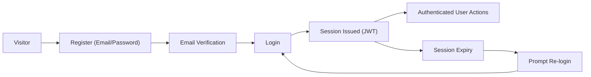
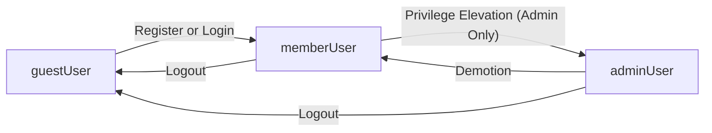
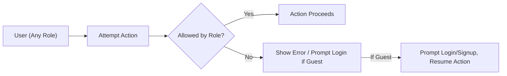

# User Roles and Authentication Requirements for Community Platform

## Authentication Requirements

- THE communityPlatform SHALL allow users to register with an email address (or flexible username) and password, storing credentials securely at all times.
- WHEN a user attempts to perform content-creation, voting, or community membership actions while unauthenticated, THE communityPlatform SHALL require and prompt for login, showing the message: "Please sign in to continue." and, on success, SHALL resume the user's original operation where possible.
- THE communityPlatform SHALL maintain user sessions that last at least 30 days since last activity, unless explicitly logged out.
- WHEN a login session expires due to inactivity, THE communityPlatform SHALL prompt a smooth re-login, keeping the user’s current screen or pending action visible.
- WHEN user login fails, THE communityPlatform SHALL display: "Login failed. Please try again." and permit further attempts without freezing the screen.
- WHEN a login session or authentication is successful, THE communityPlatform SHALL support seamless redirection and resumption of the user's previously attempted action (e.g., posting, joining, voting).
- THE communityPlatform SHALL allow users to log out, invalidating tokens and all server-session data associated with that account.
- WHERE users request password reset, THE communityPlatform SHALL support secure password reset flows via registered email.
- WHERE email verification is required, THE communityPlatform SHALL enforce verification before activating login privileges (optional but recommended).

### Authentication Workflow


## User Role Structure

Three user roles are defined, each with explicit platform capabilities:

| Role Name   | Description                                                                                                   |
|------------|--------------------------------------------------------------------------------------------------------------|
| guestUser  | Unauthenticated users who browse/search public posts, comments, sub-communities. Cannot interact, vote, join, create, or edit/delete any content. |
| memberUser | Authenticated users who can create/edit/delete their own posts or comments, create and join/leave sub-communities, vote (except on own items), and browse/search like guests. |
| adminUser  | Admins with all memberUser rights and the ability to moderate (edit/delete) all content, manage sub-communities and members, ban users, and control site-wide configuration. |

- THE communityPlatform SHALL enforce these roles across all APIs and business process logic.

### Role State Diagram


## Role Hierarchy and Permissions

### Permission Rules
- THE communityPlatform SHALL prevent guestUser from any POST, PUT, DELETE operation at the business logic layer.
- THE communityPlatform SHALL verify authorship for editing/deleting posts/comments—permitting only the original memberUser or any adminUser to do so.
- THE communityPlatform SHALL require community membership status for curated home feed personalization, but not for posting into a sub-community.
- THE communityPlatform SHALL restrict creation, editing, and deletion of sub-communities to authenticated users, with deletion of any sub-community reserved strictly for the adminUser role (with cascading deletion of all related posts/comments).
- THE communityPlatform SHALL restrict site-wide moderation, configuration, or user-banning to adminUser exclusively.
- THE communityPlatform SHALL ensure all role changes (e.g., privilege elevation to adminUser or demotion) are managed by explicit admin action, never automatic.

## Token Management

- THE communityPlatform SHALL use JWT (JSON Web Tokens) for authentication. Upon login, the server SHALL issue:
  - Access Token (expires in 30 minutes)
  - Refresh Token (expires in 30 days)
- THE communityPlatform SHALL use a secure, private signing key for JWT generation and verification.
- THE communityPlatform SHALL structure JWT payloads to always include:
  - userId (string/uuid)
  - role (string: guestUser, memberUser, adminUser)
  - permissions (explicit array)
  - exp (expires at, UNIX time)
- THE communityPlatform SHALL support secure storage of tokens—preferring httpOnly cookies for security, with localStorage permitted for convenience (developer’s choice).
- THE communityPlatform SHALL invalidate both access and refresh tokens upon logout, and support “log out from all devices” (revoking all refresh tokens).
- THE communityPlatform SHALL support silent automatic refresh of the access token using an unexpired refresh token, without impacting UI continuity.

### JWT Payload Example
```json
{
  "userId": "abc123-uuid",
  "role": "memberUser",
  "permissions": [
    "view_content",
    "create_post",
    "comment",
    "join_community",
    "vote",
    "edit_own_post",
    "delete_own_post",
    "edit_own_comment",
    "delete_own_comment"
  ],
  "exp": 1764284327
}
```

## Permission Matrix

| Action                                         | guestUser | memberUser | adminUser |
|------------------------------------------------|-----------|------------|-----------|
| View/browse/search communities, posts/comments | ✅        | ✅         | ✅        |
| Join/Leave sub-community                       | ❌        | ✅         | ✅        |
| Create post/comment                            | ❌        | ✅         | ✅        |
| Edit/delete own post/comment                   | ❌        | ✅         | ✅        |
| Edit/delete any post/comment                   | ❌        | ❌         | ✅        |
| Vote up/down                                   | ❌        | ✅         | ✅        |
| Create sub-community                           | ❌        | ✅         | ✅        |
| Delete any sub-community                       | ❌        | ❌         | ✅        |
| Moderate/ban user                              | ❌        | ❌         | ✅        |
| Configure global/site settings                 | ❌        | ❌         | ✅        |
| View activity logs                             | ❌        | ❌         | ✅        |
| Log out/log out all devices                    | ❌        | ✅         | ✅        |

## Additional Requirement Scenarios (EARS-based)

- IF a guestUser initiates any action (posting, joining, voting, etc.) that is not permitted, THEN THE communityPlatform SHALL immediately prompt login and, upon successful authentication, resume the original intent.
- IF a memberUser/adminUser attempts to edit or delete an item they did not author (unless adminUser), THEN THE communityPlatform SHALL deny the action and display: "You can edit or delete only items you authored."
- IF a user attempts to vote on their own content, THEN THE communityPlatform SHALL prevent this operation and display: "You can’t vote on your own posts/comments."
- WHEN a session expires in the midst of an operation, THE communityPlatform SHALL require re-login and, if successful, resume the flow.
- WHEN restricted actions occur, THE communityPlatform SHALL provide clear, standard, and context-appropriate messages, as defined in the [Functional Requirements Document](./05-functional-requirements.md).

### Permission Flow Diagram


## Additional Notes
- All technical implementation details, API endpoints, and data models are to be determined by the backend engineering team at their discretion. This document provides business logic and system requirements only.