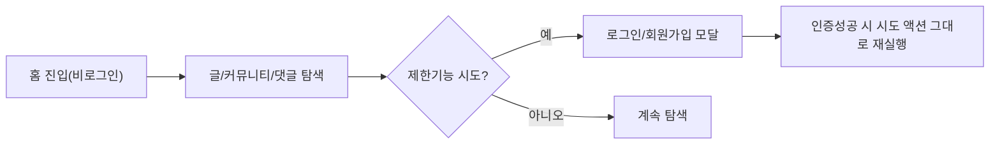
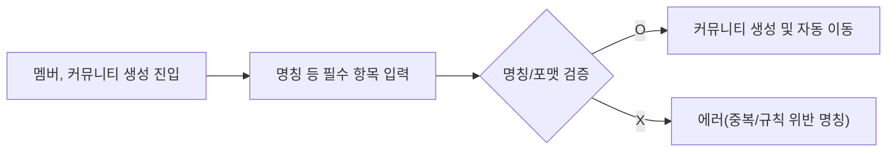
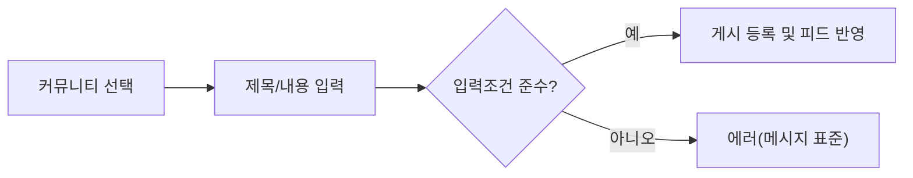
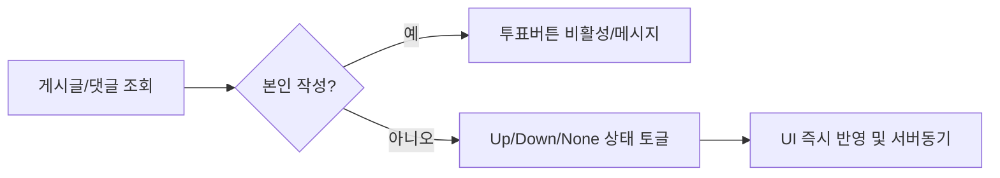

# User Journey Analysis for Community Platform

## 1. 주요 사용자(PERSONA) 유형과 역할

### 게스트(Guest)
- 로그인하지 않은 비회원으로, 플랫폼의 모든 공개 커뮤니티와 게시물, 댓글을 자유롭게 탐색/조회할 수 있음
- 게시글 작성, 댓글, 투표, 커뮤니티 가입/탈퇴, 생성은 금지됨
- 제한된 액션을 시도할 경우 즉시 로그인/회원가입 모달이 띄워짐

### 멤버(Member)
- 이메일/비밀번호 기반 가입 후 활성화된 일반 계정
- 공개글·댓글·투표·커뮤니티가입/탈퇴, 직접 만든 커뮤니티 생성·수정·삭제 가능
- 자신이 작성한 글/댓글만 수정·삭제 가능함(관리자가 아닌 한)
- 커뮤니티 가입 여부에 따라 홈 피드와 최근 커뮤니티 목록이 개인화됨

### 관리자(Admin)
- 멤버 권한을 모두 갖고, 추가로 전체 콘텐츠/커뮤니티/사용자에 대해 관리적 조치(삭제·차단·신고처리 등) 가능
- 에스컬레이션 또는 운영 실패/정책위반 상황에서 최종 조치 권한을 갖음

## 2. 대표 사용자 여정 및 시나리오

### 2.1 온보딩 및 기본 탐색 (게스트·신규 멤버)
- WHEN 방문자가 홈(/)에 접속하면 THE 시스템 SHALL 최신/인기글을 전 커뮤니티 기준으로 20개 표시함
- WHEN 게스트가 글/댓글/투표/가입/생성 등 제한된 기능을 시도할 경우 THE 시스템 SHALL "Please sign in to continue." 메시지와 함께 로그인 모달을 띄워야 함
- WHEN 로그인/회원가입 절차를 마치면 THE 시스템 SHALL 직전 시도한 액션으로 복귀시켜 진행 흐름을 유지함
- WHEN 커뮤니티 가입이 0개일 경우 THE 시스템 SHALL 상단 또는 우측 사이드바에 커뮤니티 탐색/가입 권장 안내를 노출함

### 2.2 커뮤니티 생성·관리(멤버)
- WHEN 멤버가 "커뮤니티 생성" 페이지에 진입하면 THE 시스템 SHALL 고유명칭(알파벳, 하이픈/언더스코어 허용), 카테고리 선택, 설명, 로고/배너, 규칙(선택) 입력을 요구함
- IF 커뮤니티명이 허용규칙 미충족/중복이면 THEN THE 시스템 SHALL 각각 "This name isn’t available. Please choose something simpler." 혹은 "This name is already in use."으로 안내함
- WHEN 커뮤니티가 생성되면 THE 시스템 SHALL 생성자에게만 추후 제목 등 일부 항목(명칭은 불변)에 대한 편집/삭제 권한을 부여함
- WHEN 커뮤니티를 삭제할 경우 THE 시스템 SHALL 해당 커뮤니티의 모든 포스트/댓글/멤버십 연관 데이터를 일괄 삭제함(관계형 일관성 준수)
- WHEN 멤버가 가입/탈퇴를 클릭하면 THE 시스템 SHALL 피드 및 최근 커뮤니티 목록을 즉시 갱신함(서버 동기화 실패시 오류)

### 2.3 게시판 참여(글쓰기/수정/삭제/댓글/투표)
- WHEN 멤버가 글 작성 화면에서 커뮤니티를 지정하고 제목(5~120자)과 내용(10~10,000자), (선택)작성자명 입력 후 등록하면 THE 시스템 SHALL 해당 커뮤니티에 글을 반영하고, [Home], [커뮤니티] 피드, [최신글] 등에 노출시킴
- WHEN 작성자가 아닌 멤버가 해당 글/댓글의 수정/삭제를 시도할 경우 THE 시스템 SHALL 권한 없음 에러("You can edit or delete only items you authored.")를 반환함
- COMMENT: 댓글 작성 시(2~2,000자) 계층적(쓰레드) 구조로 부모/자식 연결 보장
- VOTE: 투표는 본인 글/댓글엔 금지(시도 시 "You can’t vote on your own posts/comments.")
- WHEN 투표상태가 변하면 THE 시스템 SHALL <up/down/none> 상태를 단일 저장하고, UI상 옵티미스틱 반영 후 서버결과와 동기화함(오류시 롤백 및 "A temporary error occurred. Please try again in a moment.")

### 2.4 검색&탐색
- WHEN 사용자가 2자 이상 검색어 입력 후 검색할 경우(포스트/커뮤니티/댓글 탭별), THE 시스템 SHALL 규칙에 따라 결과(최대 20개, [Load more]로 추가 노출)와 일치율 높은 정렬 기준으로 반환함
- IF 2자 미만 입력시 THEN THE 시스템 SHALL "Please enter at least 2 characters." 메시지와 빈 결과 화면을 표시함
- WHEN 결과가 0개면 THE 시스템 SHALL "No matching results. Try different keywords." 메시지를 노출함

### 2.5 관리/운영(어드민)
- WHEN 유저 신고 또는 콘텐츠 정책위반이 발생하면 THE 시스템 SHALL 관리자에게 해당 자료 전체제거/유저 조치 등 에스컬레이션 워크플로우를 노출하고, 모든 내역을 감사로그에 남김
- WHEN 커뮤니티/포스트/댓글 등 엔티티 삭제 시 THE 시스템 SHALL 관련 하위항목 전부를 일관되게 삭제 처리함

## 3. 단계별 상호작용 플로우 (머메이드 다이어그램)

### 3.1 게스트 온보딩 플로우

### 3.2 멤버 커뮤니티 생성 플로우

### 3.3 게시글 작성 플로우

### 3.4 투표 상호작용 플로우

## 4. 확장 및 예외 시나리오
- WHEN 세션이 만료 중간에 발생(글쓰기/투표 등)하면 THE 시스템 SHALL 입력/화면을 보전, 재로그인 후 액션을 이어감
- IF 멤버가 본인 글/댓글이 아닌 항목에 수정/삭제 액션 시도 시 THEN THE 시스템 SHALL "You can edit or delete only items you authored." 에러표시
- IF 커뮤니티명·타이틀·본문·닉네임 등 입력값이 범위·포맷 위반시 각각 명세된 정확한 에러메시지 반환
- IF 옵티미스틱 UI로 먼저 반영된 투표/가입/탈퇴 등이 서버에 반영 실패 시 THEN THE 시스템 SHALL 즉각 UI를 롤백하고 에러표준메시지 노출
- WHEN 멤버십이 0개일 때 홈 피드는 전체 최신/인기글+커뮤니티 추천 안내를 반드시 노출함
- 검색 결과가 1페이지 미만일 시 추가 [Load more] 없이 즉시 빈상태 안내
- 잘못된 쿼리·삭제된 엔티티 등 접근시 "This item no longer exists or was deleted." 등 표준 메시지 및 안전복귀경로 안내

## 5. 요구사항(EARS) 요약
- WHEN 게스트가 상호작용 시도, THE 시스템 SHALL 로그인 안내와 인증완료시 재시도 액션 보장
- WHEN 멤버가 커뮤니티를 생성할 때 THE 시스템 SHALL 명칭 유니크·포맷 검증, 생성자에게 편집권한 부여
- WHEN 멤버십 토글(가입/탈퇴) 시 THE 시스템 SHALL 피드및사이드바 즉시 갱신, 서버불일치시 롤백·오류표시
- WHEN 본인 글/댓글 수정/삭제, THE 시스템 SHALL 작성자 이외 차단, 관리자 권한은 예외
- WHEN 투표 발생 THE 시스템 SHALL 본인 컨텐츠에 투표 불가/단일상태 강화, 추가 반복클릭은 None 복구
- WHERE 멤버십 0개 사용자, THE 시스템 SHALL 홈에 전체 최신글/탑글+추천안내 노출
- IF 입력값 오류, 중복명칭, 권한위반, 세션만료 등 발생시 각 조건별 표준 에러메시지, 부가적 회복플로우 명확 안내

## 6. 시나리오별 입력 검증 및 에러 메시지
- 커뮤니티명: 3~32자, 영/숫자+하이픈/언더, 중복불가 – 잘못된 입력시 명세 메시지 출력
- 제목: 5~120자, 본문: 10~10,000자, 댓글: 2~2,000자 범위강제, 초과/미달시 명세 복사 그대로 안내
- 표준 메시지 기반으로 모든 입력·정책 검증

## 7. 수용/회복 플로우 및 최종 정합성 보장
- 모든 업무 플로우는 예측가능한 입력/출력/결과/즉시 오류/회복 루프를 표준화함
- 사업/관리/개발 입장에서 예외상황까지 모두 아우르며, 자연어·EARS·머메이드 도식화 등으로 구현자에게 2차 질의 없이 완전한 명세 제공

---

[사용자 역할 및 인증·권한체계 명세](./02-user-roles-and-permissions.md), [서비스 기능 요구사항](./04-functional-requirements.md), [비즈니스 규칙](./05-business-rules.md), [오류 및 회복 처리 정책](./06-error-handling.md) 등 연관 문서와의 연계를 고려하여, 모든 업무 흐름/예외/정책이 구현자의 입장에서 누락·애매함이 없도록 설명한다.