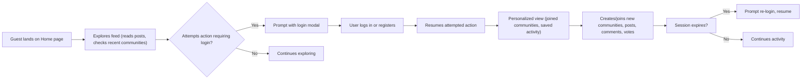

# User Scenario and Journey Analysis for Community Platform

## User Personas

### Guest User (Unauthenticated Visitor)
- **Profile:** Anyone arriving at the platform for the first time without an account or not logged in.
- **Goals/Motivations:** Explore communities and posts before committing; determine platform value before sign-up.

### Member User (Authenticated Standard User)
- **Profile:** A registered user with an active session.
- **Goals/Motivations:** Personalize experience, join communities, create, vote on, and discuss posts, contribute to topics of interest, build reputation.

### Admin User (Platform Administrator)
- **Profile:** Staff or power users with broad system authority.
- **Goals/Motivations:** Ensure healthy and safe discourse, manage platform health, enforce rules, resolve disputes, intervene in malfunction or abuse cases.

---

## Primary User Scenarios

### 1. Guest Exploration and Registration
- **Flow:**
   1. Guest arrives at platform root (/) and sees top/latest posts from all communities.
   2. Guest browses sub-communities with brief descriptions and category filters.
   3. Guest attempts to perform an action (e.g., upvote, comment, post, join), triggering a login prompt.
   4. Guest either registers a new account or chooses to continue browsing.
- **EARS Requirements:**
   - WHEN a guest attempts to post, comment, vote, join, or create, THE system SHALL require authentication and show message: "Please sign in to continue."
   - THE system SHALL make all published content readable to guests at all times.

### 2. Member Onboarding and Community Personalization
- **Flow:**
   1. New member completes registration and first login.
   2. Member is guided to explore/join communities. If none joined, home feed shows global content plus prompts to join/explore at top/right.
   3. Member joins first communities and recent activity list is immediately populated.
   4. Home feed updates to include only joined communities’ content; right sidebar always shows 10 latest posts globally.
- **EARS Requirements:**
   - WHEN a member joins a community, THE system SHALL add that community’s posts to their home feed and update their recent communities list immediately.
   - IF member is not part of any community, THEN THE system SHALL display latest/top posts from all communities with clear join guidance.

### 3. Creating/Managing Sub-Communities (for Members)
- **Flow:**
   1. Member clicks 'Create' and is presented with inputs for name, description, logo/banner, rules, and category.
   2. Name is validated for uniqueness and format.
   3. Member creates community; if successful, navigated to new community home.
   4. As creator, member may edit any details except name.
- **EARS Requirements:**
   - WHEN a member attempts to create a community, THE system SHALL check name uniqueness and required format.
   - IF name is already used, THEN THE system SHALL show message: "This name is already in use."
   - WHEN creator edits community, THE system SHALL only permit changes to title, description, logo/banner, and rules.
   - THE system SHALL prevent name edits post-creation.

### 4. Posting, Commenting, and Voting (Member Journeys)
- **Posting:**
   - Member composes a post, selects target community, enters title/body. Submission as guest triggers login prompt, then resumes.
   - Title/body formats enforced (min/max lengths, scripts/code not allowed).
   - Post is visible in main feed depending on membership, and in right sidebar if among 10 latest globally.
- **Commenting:**
   - Member reads post, adds comments or replies in nested threads.
   - May edit/delete only their own comments.
   - Comment list supports pagination (20 at a time, load more).
- **Voting:**
   - Upvote/downvote available on posts and comments (cannot self-vote).
   - Voting state toggles as per requirements, with optimistic UI.
- **EARS Requirements:**
   - WHEN a logged-in user creates, edits, or deletes a post/comment, THE system SHALL only allow these actions for the content’s author.
   - WHEN a user votes, THE system SHALL immediately update score/counts visually, then sync with the server.
   - IF a user attempts to vote on their own post/comment, THEN THE system SHALL show message: "You can’t vote on your own posts/comments."

### 5. Search, Navigation and Community Discovery
- **Flow:**
   1. User enters search query (min 2 characters).
   2. Platform displays posts (default sort: Newest), communities (name match/recent), comments (newest), with tabs.
   3. User pages through results, joins/leaves communities from within results, or navigates to posts/communities from result cards.
- **EARS Requirements:**
   - IF query is shorter than 2 characters, THEN THE system SHALL show: "Please enter at least 2 characters."
   - THE system SHALL provide 20 results per page/tab.
   - WHERE user joins/leaves a community from results, THE system SHALL reflect state changes in all navigation elements instantly.

### 6. Session, Authentication, and Permissions Journey
- **Flow:**
   1. User logs in via modal (username/email + password).
   2. Invalid attempts are gracefully handled (retry option, error message, no freezes).
   3. Session is long-lived; on expiry, non-disruptive prompt for re-authentication appears and resumes original action.
- **EARS Requirements:**
   - WHEN a session expires, THE system SHALL prompt re-login and return the user to in-progress actions.
   - IF authentication fails, THEN THE system SHALL show: “Login failed. Please try again.”

### 7. Admin Management and Remediation
- **Flow:**
   1. Admin accesses moderation view or escalated reports.
   2. May remove problematic content or sub-communities, enforce bans, or alter platform settings.
   3. All actions logged for review.
- **EARS Requirements:**
   - WHERE an admin removes a sub-community, THE system SHALL cascade-delete all posts/comments therein.
   - THE system SHALL always provide a means for admin actions to be undone or reviewed if possible.

---

## Secondary User Scenarios

- **Multi-device Continuation:** Users sign in on new browsers/devices, recent communities and preferences sync instantly.
- **Forgotten Password/Account Management:** Members recover/alter credentials with clear messaging and workflow.
- **New Community Category Emergence:** Admins introduce new community categories (platform evolution).

---

## Exceptional Cases

- **Attempted Unauthorized Edits:**
   - IF a user attempts to edit/delete content not belonging to them, THEN THE system SHALL deny the action and show: “You can edit or delete only items you authored.”

- **Pagination and Feed Boundaries:**
   - IF no more results exist on [Load more], THEN THE system SHALL show an unobtrusive “No more results.”

- **Temporary System Failures:**
   - IF a temporary error occurs (e.g., failed optimistic update, sync failure), THEN THE system SHALL show: “A temporary error occurred. Please try again in a moment.”

- **Missing Required Inputs:**
   - IF required fields (e.g., title, body, community) are omitted, THEN THE system SHALL prompt and focus the missing input, showing the relevant message (e.g., “Please choose a community to post in.”).

- **Self-Voting:**
   - IF user attempts to upvote/downvote own post or comment, THEN THE system SHALL refuse and inform them with the standard self-vote error message.

- **Search with No Results:**
   - IF a user search yields no matches, THEN THE system SHALL show: “No matching results. Try different keywords.”

---

## Sample Journey Diagram (Mermaid)

---

This analysis provides a comprehensive user scenario foundation for backend requirements, user flows, and cross-role interactions—offering clarity for both development and product management teams.