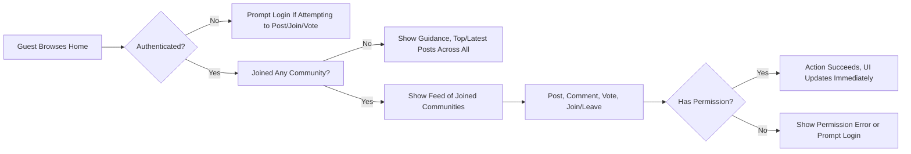

# Functional Requirements for Community Platform

## Business Logic Overview

The Community Platform enables users to discover, join, and participate in topic-based sub-communities. The platform hosts text-based posts and threaded discussions, supports upvote/downvote voting, and provides robust, personalized content feeds. Reading is open to all, but interaction (posting, commenting, voting, joining/leaving, and creating communities) is restricted to authenticated members. Admins have additional system management powers. The system prioritizes user convenience, especially around session persistence, error flows, and real-time UI updates for all major interactions.

## Feature Requirements

### 1. Sub-Communities (Communities)
- THE platform SHALL allow authenticated members to create unique, named topic-based sub-communities with optional description, logo/banner, and rules.
- THE platform SHALL only permit community creation where the name is not in use and matches the allowed pattern (alphanumeric, hyphen, underscore).
- WHEN a member creates a community, THE platform SHALL require a category selection from [Tech & Programming, Science, Movies & TV, Games, Sports, Lifestyle & Wellness, Study & Education, Art & Design, Business & Finance, News & Current Affairs].
- WHEN a community is deleted by its creator or an admin, THE platform SHALL remove all posts and comments in that community.
- WHEN a member/guest views a community, THE platform SHALL show the name, description, member count, created date, last active time, and up to 5 numbered rules.
- WHEN a user requests to join/leave a community, THE platform SHALL add/remove them from membership, adjust the home feed to include/exclude those posts, and update the 'Recent Communities' sidebar immediately.
- THE platform SHALL make community names immutable after creation.
- WHEN a community is edited, THE platform SHALL allow only the creator (or admin) to change the description, logo/banner, rules, and category—but not the name.
- IF a duplicate community name is submitted, THEN THE platform SHALL reject it and show the message: “This name is already in use.”
- IF an invalid community name is submitted, THEN THE platform SHALL reject it and show: “This name isn’t available. Please choose something simpler.”

### 2. Joining/Leaving Communities
- WHEN a member clicks the Join/Joined button, THE platform SHALL toggle their membership status and update all relevant feeds immediately (Home, Recent Communities).
- WHEN a user is not a member of any community, THE platform SHALL show top/latest posts from all communities on Home with guidance on joining communities.
- WHERE membership is toggled, THE platform SHALL not confer any moderation or admin rights—only personal feed and sidebar changes.

### 3. Posts
- THE platform SHALL allow only authenticated members to create, edit, or delete their own text-based posts (title and body) within any community.
- WHEN a member submits a post, THE platform SHALL require selection of a target community, enforce title (5-120 chars) and body (10-10,000 chars, plain text, no code/scripts) validation.
- WHERE author display name is not set, THE platform SHALL default to “Anonymous”.
- WHEN viewing posts, THE platform SHALL show: community name, title, author, created time (relative), comment count, and net score.
- WHEN a post is deleted by its author or an admin, THE platform SHALL delete all its comments.
- IF a member tries to post without selecting a community, THEN THE platform SHALL reject and show: “Please choose a community to post in.”

### 4. Comments
- THE platform SHALL allow only authenticated members to create, edit, or delete their own comments.
- WHEN composing comments, THE platform SHALL enforce a length between 2 and 2,000 chars.
- WHEN a member replies to a comment, THE platform SHALL support nested threads.
- WHEN a comment is deleted by its author or an admin, THE platform SHALL delete all its descendant replies.

### 5. Voting
- WHEN viewing posts and comments, THE platform SHALL show upvote/downvote buttons to authenticated members (except the author); guests cannot vote.
- WHEN a member votes, THE platform SHALL: allow one upvote, one downvote, or no vote per item; cannot self-vote.
- WHEN a vote occurs, THE platform SHALL update the score (upvotes minus downvotes) and reflect UI changes immediately (optimistic updates), then sync with backend.
- IF a user tries to vote on their own content, THEN THE platform SHALL reject and show: “You can’t vote on your own posts/comments.”

### 6. Feeds, Sorting, and Pagination
- THE Home main content feed SHALL show 20 post cards per page, from communities the member has joined, respecting the selected sort (Newest or Top).
- Sort logic:
  - [Newest]: Most recent creation time; ties resolved by larger identifier.
  - [Top]: Highest score; ties by latest creation time, then largest identifier.
- WHERE user is unauthenticated or not a member of any community, THE platform SHALL show top/latest posts across all communities.
- THE right 'Global Latest' sidebar on Home SHALL always show 10 most recent posts, sitewide, newest first, one line title.
- THE posts/comments lists in other contexts (Community, Search) SHALL also use pagination: 20 per page with [Load more] triggers.
- THE Recent Communities sidebar list SHALL display up to 5 most recently visited/interacted communities, showing name, icon, link.

### 7. Search
- WHEN a user enters 2+ characters in the search input, THE platform SHALL allow searching for posts (title/body), sub-communities (name/title), or comments (content), and show up to 20 results per page by default, sorted by context-relevant order (Posts: Newest/Top; Communities: Name Match/Recently Created; Comments: Newest).
- IF query is less than 2 characters, THEN THE platform SHALL reject and show: “Please enter at least 2 characters.”
- IF no results, THEN THE platform SHALL show: “No matching results. Try different keywords.”

### 8. Authentication Guards & Permissions
- THE platform SHALL allow anyone (guests) to read content and search.
- THE platform SHALL require login for posting, commenting, voting, joining/leaving, and creating/editing/deleting any content or community.
- WHEN a guest tries to perform restricted actions, THE platform SHALL prompt login and then, upon success, resume the original action.
- THE platform SHALL permit only original authors to edit/delete their own posts or comments (with admins excepted—see admin rules).

### 9. Session Handling & Expiry
- THE platform SHALL maintain login sessions for members for at least 30 days of inactivity, with user-friendly session expiry handling (prompt for relogin, preserve screen and unsaved actions).

### 10. Admin & Moderation
- WHERE a user is admin, THE platform SHALL allow all content deletion, user management, and system-wide community/post/comment moderation, following escalation and report flows.

## Validation and Input Rules
- Community name: Required, 3-32 chars, alphanumeric + hyphen/underscore, unique, immutable after creation
- Community description: Optional, up to 200 chars
- Logo/banner: Optional, must be valid image type and size (up to 5MB; default fallback provided)
- Community rules: Optional, up to 10 lines, each line ≤ 50 chars
- Category: Required, must select one of specified set
- Post title: Required, 5-120 chars, plain text
- Post body: Required, 10-10,000 chars, plain text (no code/scripts)
- Author display name: Optional, up to 32 chars; defaults to “Anonymous”
- Comment content: Required, 2-2,000 chars, plain text
- All text inputs: No scripts, code, or markup
- Membership/Join/Leave toggles: Immediate effect in UI; no validation except for logged-in status and community existence
- Sorting: As specified (see business rules above)
- Pagination: As specified (20/10 results, load more triggers)
- Voting: Only one state per item per user (upvote, downvote, or none); no self-vote

## Acceptance Criteria
- All listed requirements are met if and only if:
  - Every functional flow can be completed by a user or admin in the scenarios described
  - All input validation constraints are strictly enforced
  - All error/warning/copy messages match the standard specified wording
  - Optimistic UI updates occur for all voting/join/leaving actions, with back-end confirmation and failure handling
  - Guest guards and author guards work for all restricted actions
  - Edge cases (duplicate names, invalid input, permissions errors, expired session, concurrent updates) result in user-facing error/warning as described
  - All session persistence and expiry business logic is implemented with seamless re-login and action resumption

## Mermaid: Community Membership & Posting Flow

---

For related documentation, see [User Role and Permission Requirements](./02-user-roles-and-permissions.md), [Business Rules](./05-business-rules.md), [Error Handling Guide](./06-error-handling.md), and [Non-Functional Requirements](./07-nonfunctional-requirements.md).