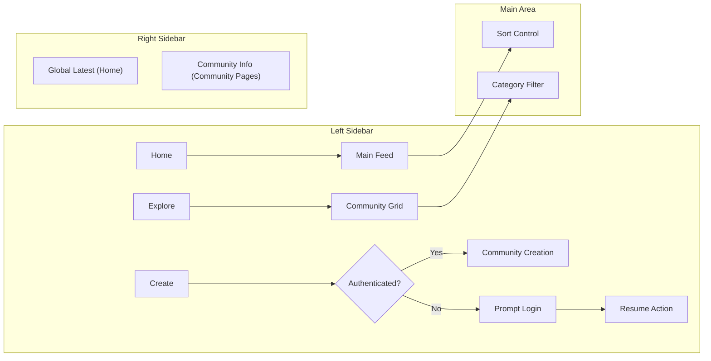
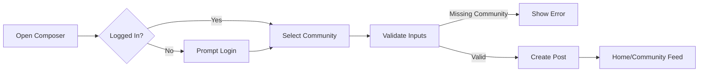
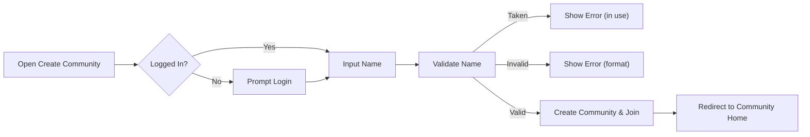
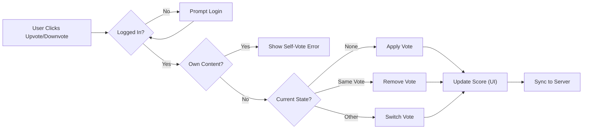
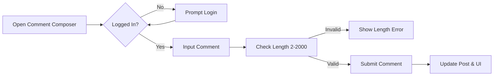
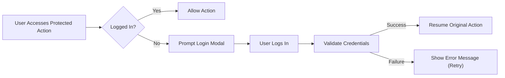

# Community Platform – User Flows & Business Logic

## 1. Introduction
This document provides a comprehensive, step-by-step specification of all major user and system workflows for the Community Platform. It maps user journeys, system responsibilities, and decision logic for post/content management, community discovery and membership, commenting, voting, session management, and authentication. Requirements are expressed in EARS format wherever applicable, ensuring clarity and immediate implementability for backend developers. Mermaid diagrams are included to illustrate complex operational flows.

## 2. Global Navigation Flow

### 2.1 Overview
Community Platform navigation relies on three persistent zones: the left sidebar (global controls), the main content area (feature context), and the right sidebar (contextual/feed info). Navigation state updates are session-aware and role-sensitive.

### 2.2 Navigation Logic (EARS)
- THE left sidebar SHALL always show “Home”, “Explore”, and “Create” buttons and a list of up to 5 recently visited/interacted communities, with community icons if available.
- WHILE user is authenticated, THE recent communities list SHALL reflect the 5 most recently accessed/joined communities.
- WHILE user is unauthenticated, THE recent communities list SHALL reflect the 5 most recently browsed communities within the session.
- WHEN “Home” is clicked, THE system SHALL display a unified main feed.
- WHEN “Explore” is clicked, THE system SHALL display a grid of sub-communities with filtering by category.
- WHEN “Create” is clicked, THE system SHALL open the community creation page (if authenticated), or prompt login (if guest).
- IF the user triggers a navigation action requiring authentication and is not authenticated, THEN THE system SHALL display a login modal and, on successful login, resume the attempted action.
- THE right sidebar on Home SHALL always display the 10 most recent posts globally, sorted by newest creation time.
- THE right sidebar on sub-community and post pages SHALL display the target community’s info, rules (up to 5, numbered), and summary data.

### 2.3 Navigation Flow Diagram

---

## 3. Post Creation and Editing Flow

### 3.1 Creating a Post (EARS)
- WHEN a logged-in user opens the post composer, THE system SHALL allow the user to select a target sub-community, enter a title (5–120 chars), and body (10–10,000 chars, plain text).
- IF the user attempts to submit without selecting a community, THEN THE system SHALL show “Please choose a community to post in.”
- IF the user attempts submission while not logged in, THEN THE system SHALL prompt login; upon successful login, resume with filled-in post data.
- THE system SHALL associate the post with the selected sub-community, author info, timestamp, and initial score of zero.
- WHERE author display name is empty, THE system SHALL display "Anonymous" as author.

### 3.2 Editing and Deleting a Post (EARS)
- WHEN a user opens their own post, THE system SHALL show “Edit” and “Delete” options.
- IF a user attempts to edit/delete a post not authored by them, THEN THE system SHALL show “You can edit or delete only items you authored.” and deny the action.
- WHEN a post is deleted, THE system SHALL remove the post, all its votes, all comments, and child comments. IF the deleted post is the last in a sub-community, THE system SHALL update all relevant counts and feeds.

### 3.3 Post Creation/Editing Flow Diagram

---

## 4. Community Creation and Membership Flow

### 4.1 Creating a Sub-Community (EARS)
- WHEN a logged-in user accesses the community creation form, THE system SHALL validate the name is unique and follows format (short, readable, alphanumeric, hyphen/underscore).
- IF the name is taken, THEN THE system SHALL show “This name is already in use.”
- IF the name is invalid, THEN THE system SHALL show “This name isn’t available. Please choose something simpler.”
- THE system SHALL allow (but not require) a description, logo/banner, and rules (brief, numbered).
- ON successful creation, THE system SHALL redirect to the new community’s home page and auto-join the creator.

### 4.2 Editing and Deleting a Community (EARS)
- WHEN a user is the creator of a community, THE system SHALL allow editing of description, logo/banner, and rules, but NOT the name.
- WHEN delete is triggered (by admin or creator), THE system SHALL remove the community, all its posts, comments, votes, and memberships.

### 4.3 Joining/Leaving a Community (EARS)
- WHEN an authenticated user presses “Join” on a community, THE system SHALL add the community to user’s list, update member count, update Recent Communities, and include its posts in their home feed.
- WHEN “Leave” is triggered, THE system SHALL remove community from user’s joined list, update Recent Communities, and exclude its posts from their home feed.
- Membership SHALL not confer special moderation or admin privileges.

### 4.4 Community Flow Diagram

---

## 5. Voting Flow

### 5.1 Voting on Post or Comment (EARS)
- WHEN a logged-in user presses an upvote or downvote button on a post/comment, THE system SHALL record their single current state (none, upvote, or downvote) and update the score immediately (optimistic UI).
- IF the user presses an active vote button again, THEN THE system SHALL revert their vote to none.
- IF the user attempts to vote on their own post/comment, THEN THE system SHALL show “You can’t vote on your own posts/comments.” and ignore the input.
- THE score for each item SHALL be computed as upvotes minus downvotes.
- Vote status SHALL be persisted per-user and per-item.

### 5.2 Voting Flow Diagram

---

## 6. Commenting Flow

### 6.1 Commenting and Replies (EARS)
- WHEN a logged-in user submits a comment, THE system SHALL validate that content length is 2–2,000 chars, associate the comment with the post, parent (for replies), and author, and update counts.
- THE system SHALL support nested replies for threaded discussions.
- WHEN viewing comments, THE system SHALL load comments in pages of 20, newest first (or as per sort).
- WHEN a user opens their own comment, THE system SHALL show Edit and Delete options.
- IF the user attempts to edit/delete another’s comment, THEN THE system SHALL show “You can edit or delete only items you authored.”
- WHEN deleting a comment, THE system SHALL delete all its child replies recursively.

### 6.2 Commenting Flow Diagram

---

## 7. Authentication and Session Flow

### 7.1 Login & Session Management (EARS)
- THE system SHALL allow users to register or log in with email or username and password.
- WHEN a login session expires, THE system SHALL prompt the user for a smooth re-login without interrupting their current screen or input.
- THE system SHALL persist login for a long session (e.g., 30 days inactivity timeout).
- IF a guest attempts any action needing authentication, THEN THE system SHALL display "Please sign in to continue." and, on successful login, resume the original intent.
- WHEN a login fails, THE system SHALL show "Login failed. Please try again." and not freeze the input.
- IF a user logs out or expires session, THEN THE system SHALL invalidate all authentication tokens and restrict all member-only actions.

### 7.2 Authentication Flow Diagram

---

## 8. Workflow Diagrams (Summary)
(Mermaid diagrams for each main flow are embedded in their respective sections above for immediate context.)

---

## 9. Error Handling in User Flows
- IF an unauthenticated user attempts protected action, THEN THE system SHALL block and show login prompt, then resume once authenticated.
- IF an action fails for transient reasons (e.g., network/server error), THEN THE system SHALL show “A temporary error occurred. Please try again in a moment.”
- IF required input is malformed or missing (e.g., short post title), THEN THE system SHALL show the standard validation message per field.
- IF a user attempts unauthorized deletion or edit, THEN THE system SHALL show the appropriate permission error.
- WHILE updating UI optimistically, IF server update fails, THEN THE system SHALL revert to the correct state and inform the user of the error.

---

## 10. Success Criteria and User Experience Requirements
- THE system SHALL present relative timestamps localized to user timezone (e.g., "just now", "X minutes ago") for all content.
- THE system SHALL use compact number abbreviations ("1.2k", "12.3k", "1.2m" etc.) for count displays.
- WHEN a user triggers an action (post, vote, comment, join), THE system SHALL reflect the update in the UI instantly (optimistic) and confirm/correct after server sync.
- THE system SHALL show all standard messages and guidance as specified in the product requirements.
- THE complete set of user flows, including all edge and error cases, SHALL be implemented as described for a seamless backend and user experience.