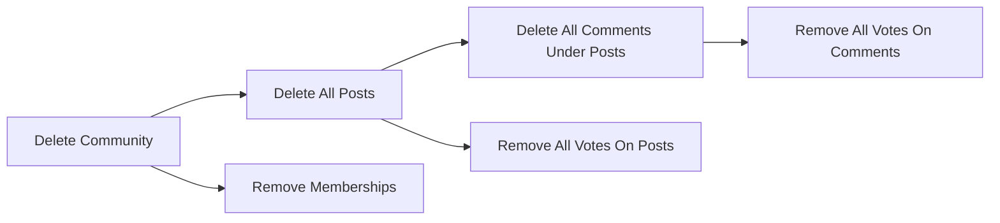

# Business Rules for Community Platform

This document defines all business rules for the Community Platform, including entity-specific constraints, cross-entity relationships, and platform-wide consistency requirements. Rules are articulated in natural language, using EARS format where applicable, and are meant to enable backend developers to build robust, consistent business logic.

---

## Core Entity Rules

### 1. Sub-Community (Community)
- WHEN a user creates a sub-community, THE system SHALL require a unique, short, readable alphanumeric community name (allowing hyphens and underscores; case-insensitive); name must not match any existing community.
- IF a sub-community name is not unique or does not match format constraints, THEN THE system SHALL reject the creation and show the standard error message.
- WHEN a sub-community is created, THE system SHALL optionally store description, logo/banner, category, and rules.
- WHEN a sub-community is created, THE system SHALL record the creator as its owner.
- THE system SHALL keep community names immutable after creation.
- WHEN editing a community, THE system SHALL restrict editing rights (title, description, logo/banner, rules) to the creator only.
- WHEN deleting a community, THE system SHALL remove all posts and comments belonging to that community (cascade deletion).
- WHEN a community is deleted, THE system SHALL immediately remove it from all lists (member lists, recent, explore, etc.).
- THE system SHALL display up to five of the most recently joined or interacted-with communities per user in Recent Communities lists, updating immediately upon join/leave actions.

### 2. Membership (Join/Leave)
- WHEN a member clicks "Join" on a community, THE system SHALL add that user to the community’s membership and update their personalized home feed and Recent Communities list instantly.
- WHEN a member clicks "Leave," THE system SHALL remove that user from the membership, updating their feed and Recent Communities list.
- THE system SHALL ensure that joining/leaving a community has no effect on moderation or ownership privileges.
- IF a user is not authenticated, THEN THE system SHALL reject join/leave actions and prompt the login required message.

### 3. Posts
- WHEN creating a post, THE system SHALL require selecting a sub-community.
- THE system SHALL require a post title (5–120 chars) and body (10–10,000 chars, plain text; scripts/code not allowed).
- IF title or body do not meet length or format requirements, THEN THE system SHALL reject the post and show the standard error message.
- WHEN a post is created, THE system SHALL associate it to its selected sub-community and author.
- THE system SHALL permit editing or deleting a post only by its author (or admin via moderation flows).
- WHEN a post is deleted, THE system SHALL delete all comments under that post (cascade deletion).
- THE system SHALL forbid users from voting on their own posts.
- WHEN displaying a post, THE system SHALL calculate its score as upvotes minus downvotes.
- THE system SHALL automatically anonymize display name when not specified, showing the default value.
- IF no community is selected on submit, THEN THE system SHALL reject the action and show the standard error message.

### 4. Comments
- WHEN creating a comment, THE system SHALL require an authenticated user, a valid parent post, and a content length of 2–2,000 characters (plain text only).
- IF content rules are violated, THEN THE system SHALL reject the comment and show the standard error message.
- THE system SHALL support threaded/nested comments via a parent-child structure.
- THE system SHALL permit editing/deleting a comment only by its author (or admin via moderation flows).
- WHEN a post or parent comment is deleted, THE system SHALL cascade delete all associated child comments.
- THE system SHALL forbid users from voting on their own comments.
- WHEN displaying a comment, THE system SHALL show its score as upvotes minus downvotes.

### 5. Voting
- WHEN a user votes (upvote/downvote/none) on a post or comment, THE system SHALL store a single current vote state per user per item.
- THE system SHALL enforce mutual exclusivity; a user may not upvote and downvote simultaneously.
- THE system SHALL allow direct toggling of state (None<->Up->Down->None), following the described UI behavior.
- IF the user tries to vote on their own content, THEN THE system SHALL reject the action and show the self-vote error message.

### 6. Categories and Rules
- WHEN creating a community, THE system SHALL require selecting one valid category from the defined category list.
- THE system SHALL validate that category is present and allowed.
- THE system SHALL limit community rules to five entries, each no more than two lines (about 50 characters per rule), enforcing content brevity at entry or display.

### 7. Users
- WHEN an unauthenticated user attempts to perform any content creation, edit, delete, voting, join or leave actions, THE system SHALL prompt login, then resume the attempted action upon successful authentication.
- THE system SHALL treat accounts as content owners for all ownership and permission checks.

---

## Cross-Entity Logic and Cascade Effects

- WHEN deleting a sub-community, THE system SHALL remove all posts and comments belonging to that community (full cascade deletion, including votes and memberships).
- WHEN deleting a post, THE system SHALL remove all associated comments (nested/cascading), and votes for that post and its comments.
- WHEN a comment is deleted, THE system SHALL remove all its child comments and votes.
- WHEN a user account is deleted, THE system SHALL remove or anonymize their authored posts and comments, revoke votes made by the account, and remove community memberships. (Anonymization rules apply where required to avoid orphaning content.)
- THE system SHALL maintain referential integrity to prevent entities from referring to deleted items (e.g., no post may exist without a valid community; no comment without a valid parent post/comment).
- IF multiple concurrent deletes or updates affect the same entity tree, THEN THE system SHALL resolve final state with referential integrity and idempotency.

Mermaid Diagram: Cross-entity Cascade Deletion (example for deleting a sub-community)

---

## Consistency and Integrity Requirements

- THE system SHALL enforce name uniqueness for all communities at time of creation, in a case-insensitive manner.
- THE system SHALL validate all entity references before creation (e.g., posts can only be attached to existing communities; comments must belong to existing posts/comments).
- THE system SHALL ensure that all join/leave, voting, and content modification actions take effect immediately and be displayed optimistically to the user, synchronized with server consistency at the next opportunity.
- THE system SHALL prevent orphan records: when a parent entity is deleted, all its children must be deleted or appropriately anonymized/cleaned up, with no dangling references.
- THE system SHALL not allow membership integrity violations (e.g. users cannot be in more than once per community, cannot join deleted communities, etc.).
- THE system SHALL support deterministic sort order for all feeds and lists as defined in product requirements. Equal score or time must resolve by larger identifier.

Edge Case and Concurrency Examples:
- WHEN two users attempt to create communities with the same name near-simultaneously, THE system SHALL allow only one and reject the other.
- WHEN actions happen out of order due to race conditions (e.g., voting on a post that is then deleted), THE system SHALL ensure the result is consistent with all current integrity rules and show appropriate error if an item no longer exists.
- THE system SHALL ensure that display of numbers (such as votes, member counts) remains accurate after all entity operations.

---

## Enforcement and Exceptions
- IF a business rule cannot be satisfied due to system constraints or unexpected errors, THEN THE system SHALL fail gracefully and show a generic temporary error message, maintaining data consistency at all times.
- THE system SHALL ensure that error or exception scenarios never result in inconsistent, orphaned, or partial data updates.

---

## Summary
These business rules define the core logic, entity relationships, and required system integrity constraints to be enforced in all backend processes for the Community Platform. They serve as the single point of truth for developers to implement robust, reliable, and business-consistent operations throughout all data-modifying workflows.

