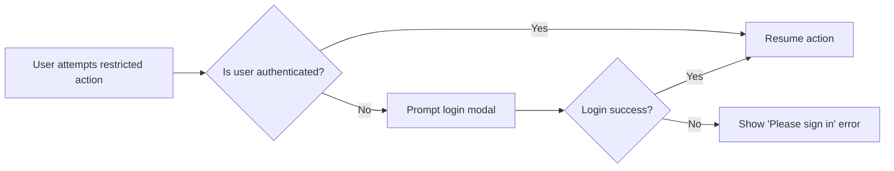
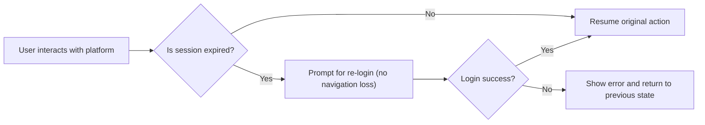
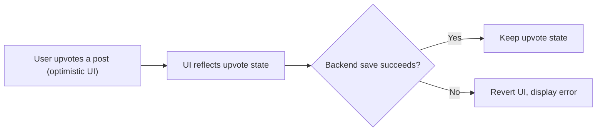

# 1. Introduction

## 1.1 Purpose of Document
This document provides a comprehensive analysis of error handling, exception scenarios, and user-facing error messages for the communityPlatform service. It details how all backend error states should be surfaced to users, standardized responses, and the business requirements for error recovery and resiliency across the platform.

## 1.2 Scope and Applicability
This error handling guide applies to all backend-managed features described in the Community Platform requirements. All features and endpoints must comply with these standards to ensure a consistent and user-guided experience.

# 2. Error Scenarios by Feature

## 2.1 Authentication and Session Management
- Login Failure: Incorrect identifier or password, or locked/banned accounts.
- Session Expiry: User token/session expires after long period.
- Token Tampering: Malformed or manipulated JWT presented.
- Unauthorized access: User tries to perform an action requiring authentication or outside their privileges.

## 2.2 Sub-Community Management
- Duplicate Community Name: Attempt to create a community with an existing name.
- Invalid Name Format: Name fails allowed character/length requirements.
- Unauthorized Edit/Delete: User tries to modify community not created by them (unless admin).
- Attempting actions on deleted (or not found) community.

## 2.3 Posts and Comments
- Missing Required Fields: Title/body too short, no sub-community, etc.
- Content Length Exceeded: Input above allowed limits.
- Unauthorized Edit/Delete: User attempts to modify content authored by others (unless admin).
- Attempting actions on deleted or missing post/comment.

## 2.4 Voting Mechanism
- Self-voting: User tries to vote on their own content.
- Repeat/Toggling Errors: User submits the same vote action too rapidly (race conditions).
- Voting without authentication.

## 2.5 Sorting, Search, and Pagination
- Query Too Short: Search queries under minimum length.
- No Results: No results for given search (empty state is NOT an error, but requires a standard message).
- Invalid Pagination: User requests pages beyond available result set.

## 2.6 Other User Actions
- Join/Leave: Join/leave actions when not logged in.
- Membership/State Mismatch: Trying to join already-joined or leave unjoined communities.
- Attempting restricted actions (e.g., posting in a deleted community).

# 3. Standard Error Messages (User-Facing)

| Error Scenario                                 | User-Facing Message                                         |
|------------------------------------------------|-------------------------------------------------------------|
| Login required for action                      | Please sign in to continue.                                 |
| No permission (not author)                     | You can edit or delete only items you authored.             |
| Duplicate community name                       | This name is already in use.                                |
| Community name format invalid                  | This name isn’t available. Please choose something simpler. |
| No community selected for post                 | Please choose a community to post in.                       |
| Query too short                               | Please enter at least 2 characters.                         |
| Self-vote attempted                            | You can’t vote on your own posts/comments.                  |
| Temporary/unknown system error                 | A temporary error occurred. Please try again in a moment.   |
| Not found / deleted entity                     | This item no longer exists or was deleted.                  |
| Input field too short or missing               | Please fill out required fields.                            |
| Input field exceeds limit                      | Your input is too long. Please shorten it.                  |
| Action failed due to outdated session          | Your session expired. Please sign in again.                 |

Additional messages shall be extended as new error scenarios are identified.

# 4. User Recovery Flows and Requirements

## 4.1 Login and Session Expiry Recovery
- WHEN a user tries to post, comment, vote, join, or create content while unauthenticated, THE system SHALL prompt for login and, upon success, resume the attempted action in-place.
- WHEN a session expires during an action, THE system SHALL gently prompt for smooth re-login without navigation loss, and, upon re-authentication, SHALL return the user to their in-progress operation.

## 4.2 Failed Actions Recovery
- WHEN a prohibited or failed action occurs (edit, delete, vote, etc.), THE system SHALL display the relevant error message.
- IF the failed action is retryable (e.g., a transient server/network error), THEN THE system SHALL allow the user to retry without data loss.

## 4.3 Data Recovery and Idempotency
- WHEN a user attempts to re-submit a previously failed retryable action, THE system SHALL handle the action as idempotent and avoid duplicate side effects (e.g., double votes, double posts).

## 4.4 Optimistic UI and Error Reconciliation
- WHEN an optimistic UI update is reversed due to backend failure, THE system SHALL clearly and promptly revert the affected UI state and inform the user of the failure with the standard message.

## 4.5 Error Retry and Guidance
- WHEN a user faces a recoverable error (network interruption, timeout), THE system SHALL present a retry option and display guidance if the issue persists.
- WHEN an unrecoverable or permanent error is encountered, THE system SHALL inform the user and, where applicable, suggest a safe navigation alternative (e.g., return home, explore communities).

# 5. Requirements in EARS Format

## 5.1 Ubiquitous/Error State Requirements
- THE communityPlatform SHALL present standard, user-friendly error messages in the user’s locale language for all recognized failure scenarios.
- THE communityPlatform SHALL log and monitor all error events for operational visibility.

## 5.2 Event-driven and Recovery Requirements
- WHEN a user attempts a restricted or unauthenticated action, THE communityPlatform SHALL prompt for login and, upon success, resume the initial intent.
- WHEN a session expires, THE communityPlatform SHALL prompt re-login and then resume the prior context without screen reset.
- WHEN a prohibited self-vote is attempted, THE communityPlatform SHALL block the action and show the self-vote error message.
- WHEN a duplicate or invalid community name is provided, THE communityPlatform SHALL block creation and display the appropriate name error.
- WHEN a required field is missing or too short, THE communityPlatform SHALL prevent submission and highlight the problematic input with the corresponding error copy.
- WHEN an action is forbidden due to permission or ownership, THE communityPlatform SHALL prevent the action and display a no-permission error.
- WHEN a user inputs an invalid or expired search query, THE communityPlatform SHALL display the minimum query length error or empty-state guidance.
- WHEN an input exceeds limits, THE communityPlatform SHALL display the length exceeded message prior to processing.
- WHEN a network or temporary server failure occurs during an action, THE communityPlatform SHALL surface the temporary error message and allow the user to retry.

## 5.3 Unwanted Behavior/Edge Case Handling
- IF an entity (post, comment, community) targeted by an action has been deleted or is not found, THEN THE communityPlatform SHALL inform the user that the item no longer exists.
- IF duplicate or rapid duplicate requests are received for any retryable action (such as voting), THEN THE communityPlatform SHALL ensure idempotency and display an appropriate message if necessary.
- IF a user attempts to edit/delete content they do not own (unless admin), THEN THE communityPlatform SHALL deny the action.

# 6. Example Error Flow Diagrams (Mermaid)

## 6.1 Login Required Action

## 6.2 Session Expiry During Action

## 6.3 Optimistic Action Fails

# 7. Appendix: Comprehensive Error Message Table

| Error Key         | Message                                                    | Usage Context          |
|-------------------|------------------------------------------------------------|------------------------|
| login_required    | Please sign in to continue.                                | Any gated feature      |
| no_permission     | You can edit or delete only items you authored.            | Edit/Delete others’    |
| community_taken   | This name is already in use.                               | Community creation     |
| name_invalid      | This name isn’t available. Please choose something simpler. | Community creation     |
| no_community      | Please choose a community to post in.                      | Post composer          |
| query_too_short   | Please enter at least 2 characters.                        | Search                 |
| self_vote         | You can’t vote on your own posts/comments.                 | Vote on own content    |
| temp_error        | A temporary error occurred. Please try again in a moment.  | General fallback       |
| not_found         | This item no longer exists or was deleted.                 | Entity deleted/missing |
| field_required    | Please fill out required fields.                           | Composer missing input |
| field_too_long    | Your input is too long. Please shorten it.                 | Composer over limit    |
| session_expired   | Your session expired. Please sign in again.                | Auth/session           |

All backend error responses SHALL use these standard keys and messages for localization, consistent handling, and logging.