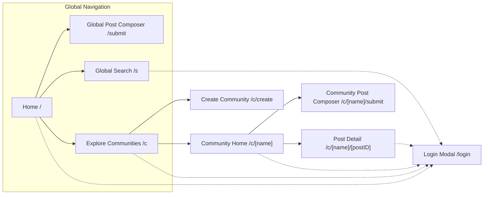
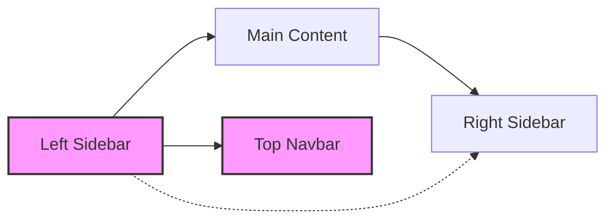
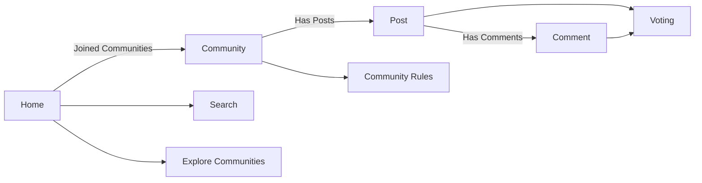

# Information Architecture for Community Platform

## Information Architecture Overview

The information architecture is designed to support an open yet secure, highly navigable topic-based community platform that enables users to discover, join, participate, and manage sub-communities, posts, comments, and related features. The architecture reflects business principles of transparency, user-driven content, smooth onboarding, and personalized content delivery while maintaining strictly delineated roles and permissions (see [User Roles and Authentication Requirements](./02-user-roles-and-authentication.md)).

### Principles and Scope
- THE system SHALL provide global navigation and content discovery for all public areas, while gating creation and participation features behind login where required by business rules.
- WHEN a user navigates between key content areas (home, sub-communities, posts, search, creation flows), THE context (such as joined communities, session state, and recent activity) SHALL persist and be reflected in navigation and content listings.
- THE architecture SHALL define clear boundaries between global, community-specific, and user-specific views, reliably segmenting data per business logic.

## Sitemap Details

The sitemap enumerates all major and secondary pages, their navigation structure, and parent-child relationships. Navigation flows are driven by both unauthenticated (guest) and authenticated (member/admin) user states.

### Sitemap Table
| Route                       | Description                                                | Access           | Parent         |
|-----------------------------|-----------------------------------------------------------|------------------|---------------|
| /                           | Home – personalized feed or global posts                  | All users        | Root          |
| /submit                     | Global post creation                                      | Authenticated    | Home          |
| /s                          | Search: communities, posts, comments                      | All users        | Home          |
| /c                          | Explore sub-communities                                   | All users        | Home          |
| /c/create                   | Create a sub-community                                    | Authenticated    | Explore       |
| /c/[name]                   | Sub-community home                                        | All users        | Explore       |
| /c/[name]/submit            | Create post in community                                  | Authenticated    | Community     |
| /c/[name]/[postID]          | Post detail with comments                                 | All users        | Community     |
| /login (modal)              | Login/Sign-up overlay                                     | All users        | Any           |

#### Mermaid Diagram: Sitemap and Navigation Flow

#### Navigation Flow Notes (EARS):
- WHEN any action requiring authentication is initiated by a guestUser, THE system SHALL present the login modal and, after successful authentication, resume the previous context and intended action.
- WHEN a user navigates to a sub-community, THE system SHALL update the left sidebar's recent communities list and adjust the feed accordingly.

## Global Layout Patterns

The global layout defines elements and regions that persist across all screens, ensuring continuity of navigation and context. The primary components are:
- Left Sidebar: Home, Explore, Create, Recent Communities (up to 5)
- Top Navbar: Logo (Home link), global search, profile, create post button
- Main Content: Primary content area per page
- Right Sidebar: Context-sensitive; home shows "Global Latest", community pages show community info/rules

#### Mermaid Diagram: Global Layout Structure

#### Persistence and Context Rules (EARS):
- THE left sidebar SHALL remain fixed on all pages, showing global navigation and real-time context (recent communities).
- THE right sidebar SHALL contextually present either the global latest posts or community information/rules, per the visited page.
- WHEN navigating between pages, THE user's navigation state (sort selection, feed position) SHALL persist unless explicitly changed.
- WHILE login modal is active, THE background context SHALL remain visible and interaction-ready post-login.

## Page-Level Content Structure

This section covers the primary content elements, feature areas, and their information relationships for each major page. Each structure ensures that backend data and business rules drive frontend representation (see [Functional Requirements](./05-functional-requirements.md)).

### Home Page (/)
- Sort Dropdown: [Newest] | [Top]
- List of 20 posts from joined communities (default), or all if no joined communities.
- Post Card: community name (/c/[name]), title, author, relative time, comment count, score
- [Load more] expands by 20 post cards
- Right Sidebar: "Global Latest" – 10 most recent sitewide posts (no load more)

**EARS Requirements:**
- WHEN a memberUser joins a new community, THE system SHALL immediately add its posts to their home feed and move the community to the top of Recent Communities.
- IF a memberUser has not joined any communities, THEN THE home feed SHALL show latest or top posts from all platforms and display guidance to join/explore communities.
- IF a guestUser attempts to post, comment, vote, join/leave, or create, THEN THE system SHALL present the login modal with contextual return.

### Community Home (/c/[name])
- Header: Logo (if any), community name, Join toggle, Create Post button
- Sort: [Newest] | [Top]
- Post composer (if authenticated)
- List: 20 posts (pagination), [Load more]
- Right Sidebar: Info box (name, description, created/last active dates (if available), community rules (top 5 shown, numbered))

**EARS Requirements:**
- WHEN a memberUser toggles Join, THE system SHALL immediately update the membership, adjust home feed inclusion, and update Recent Communities.
- WHEN a memberUser creates a post, THE system SHALL require a valid title (5-120 chars), body (10-10,000 chars), and target community selection.

### Post Detail (/c/[name]/[postID])
- Top: Community name, logo, Back button
- Main: Title, author, relative time, post body, up/down vote controls, comment count
- Comments: 20 per page, [Load more], composer at top (if authenticated)
- Edit/Delete only for current user's items
- Right Sidebar: Community Info and Rules

**EARS Requirements:**
- WHEN a memberUser posts a comment, THE system SHALL require a body (2-2,000 chars), enforce authorship for editing/deleting, and nest replies as threaded.
- IF a user attempts to vote on their own content, THEN THE system SHALL prevent the action and show an error message.

### Global Post Composer (/submit) & Community-Specific Composer (/c/[name]/submit)
- Main: Community selector (or pre-selected), Title, Body, Optional display name (0-32 chars), Submit
- IF submitted unauthenticated, THEN THE system SHALL show the login modal and return to complete submission upon login.

### Explore Sub-Communities (/c)
- Category filter chips
- 20 community cards per page ([Load more])
- Card: Community name, logo/icon, member count, Join/Joined button, description (max 2 lines)

### Global Search (/s)
- Search input (2+ chars required, keeps focus)
- Results: Three tabs (Posts [Newest|Top], Sub-communities [Name match|Recently created], Comments [Newest])
- Posts: 20 per page ([Load more]), fields: community, title, body snippet, author, time, comment count, score
- Sub-Communities: 20 per page, sorted as above, fields: community, description, logo, join button
- Comments: 20 per page, content, author, time, parent post, community
- Empty states: "Please enter at least 2 characters." / "No matching results. Try different keywords."

### Create Community (/c/create)
- Fields: Name (unique, hyphen/underscore allowed), Description (optional), Logo/Banner (optional), Rules (optional), Category selector, Create button
- On successful creation, redirect to community home

### Login & Sign Up Modal (/login)
- Modal overlay on any screen
- Inputs: user identifier (email/username), password
- Buttons: Sign in, Sign up
- Error: Show user-friendly retry message, never block flow
- On success, resume previous action/context

## Content Area Relationships

- Home is the aggregation hub (joined communities → posts → comments).
- Communities are parent containers for posts, which are parent to comments.
- Join/leave, voting, and user creation are stateful actions reflected in global layout components.
- Navigation context (last visited, recent activity) determines ordering in sidebars and feeds.

#### Mermaid Diagram: Page and Entity Relationships

## Cardinality and Business Logic
- A user may join multiple communities (N:N member to community, each membership reflected in home feed and sidebar).
- A community contains many posts; a post has one parent community.
- A post has many comments, comment nested by parent (threaded), each comment belongs to one post.
- Voting is per user per post/comment, with restrictions (no self-voting).
- Rules, categories, and user participation are centered on business validation – e.g., unique names, content length, input validation (for these, substantiate by referencing [Business Rules and Validation Requirements](./11-business-rules-and-validation.md)).

## Navigation and State Management

- Navigation must always reflect current authentication and session.
- Interaction attempts that exceed permissions result in contextual error messaging (see [Exception Handling Requirements](./07-exception-handling.md)).
- State changes (join, vote, comment/post actions) must be immediately visible in UI and update backend entities, propagating through session context and navigation areas.
- Pagination via "Load more" is standardized at 20 items per page (except right sidebar Global Latest at 10 posts, and search/comments as defined above).

## Conclusion

This information architecture specifies the full navigation and structural relationships between all primary content areas, pages, and feature flows of the community platform. All business rules, validation, and role-based access controls must be implemented as defined in related business requirement documents. Backend developers should use this as a definitive map to ensure consistent navigation, context persistence, screen-level data boundaries, and feature interconnectivity in all backend-delivered logic.