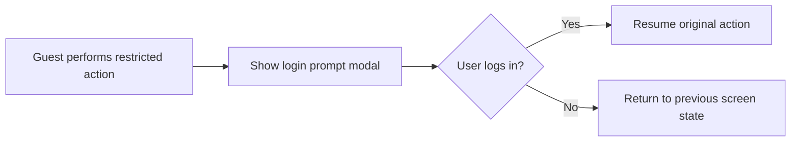
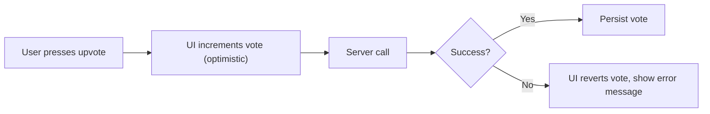
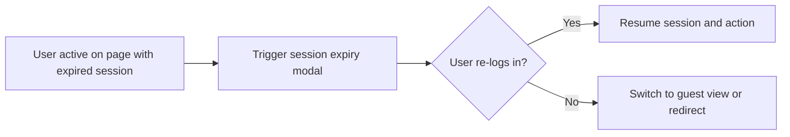

# Exception Handling Requirement Analysis for Community Platform

## General Error Handling Principles

- THE system SHALL handle all expected and unexpected errors gracefully, ensuring users experience clear feedback, easy recovery options, and minimal disruption.
- THE system SHALL display standardized, user-friendly error messages in response to all recognized business and application errors.
- WHEN an unhandled system error occurs, THE system SHALL log the error for backend review, and present a generalized error message to the user without exposing internal details.
- THE system SHALL prioritize immediate UI updates for optimistic actions, but must offer fast, informative correction if server-side failures occur.
- THE system SHALL never expose sensitive technical details to end users through error messages or UI alerts.

## Guest Guard Scenarios

### Posting, Commenting, Voting, Joining/Leaving, Creating Communities (Login Required Actions)
- WHEN a guestUser triggers an action requiring authentication (posting, commenting, voting, joining/leaving a community, community creation), THE system SHALL prompt with "Please sign in to continue." and present a login modal overlay.
- WHEN a guest user completes authentication after such an action, THE system SHALL resume the original action without data loss or unnecessary repetition of input.
- IF a guestUser attempts to submit or interact with any feature requiring authentication, THEN THE system SHALL deny the action and display the standardized login-required message immediately.
- WHEN a guestUser accesses pages or features that are view-only (reading content, searching, browsing communities), THE system SHALL allow full access without blocking or prompting for login.
- WHEN a guestUser tries to perform restricted actions repeatedly after dismissal, THE system SHALL re-prompt without limiting the number of attempts, but must never enter into a loop or lock the screen.

### Error Messages
| Scenario                                    | Message                                  |
|---------------------------------------------|------------------------------------------|
| Action requires login                       | Please sign in to continue.              |

## Author Guard Scenarios

- WHEN a user (memberUser or adminUser) attempts to edit or delete a post or comment that they do not own, THE system SHALL block the action and display "You can edit or delete only items you authored."
- WHEN the edit/delete UI is presented, THE system SHALL ensure only items authored by the current user show Edit/Delete controls; all others must exclude such options.
- IF a user forges or hacks UI requests to edit/delete other users’ content, THEN THE system SHALL reject the request, log the attempt, and respond with the standardized error message.

### Error Messages
| Scenario                                            | Message                                      |
|-----------------------------------------------------|----------------------------------------------|
| Edit/Delete of non-owned item                       | You can edit or delete only items you authored. |

## Session Expiry Handling

- WHEN a user's session expires, THE system SHALL display a gentle prompt to "Please sign in to continue.", presented as a modal overlay that preserves the current UI context.
- WHEN a user completes re-login following session expiry, THE system SHALL restore them to the same screen and resume any in-progress or attempted action, unless security concerns require re-entry.
- THE system SHALL never interrupt the screen display or cause loss of unsaved data when prompting for session renewal.
- WHEN a user cancels a session renewal prompt, THE system SHALL return to a read-only state (if allowed) or gracefully guide them to the login page.

### Error Messages
| Scenario               | Message                           |
|------------------------|-----------------------------------|
| Session expired        | Please sign in to continue.       |

## Optimistic UI Failures

- WHEN users perform optimistic actions (e.g., upvote/downvote/join/leave/comment/post) and the server operation fails, THE system SHALL revert UI changes immediately and display a context-appropriate error notification.
- IF a temporary technical or network error occurs, THEN THE system SHALL display “A temporary error occurred. Please try again in a moment.” and offer a retry option where appropriate.
- IF a duplicate action is attempted (e.g., rapidly pressing vote buttons), THEN THE system SHALL prevent multiple submissions and display only one confirmation or error as appropriate.
- IF the server detects inconsistent state (e.g., self-vote attempt, invalid commands), THEN THE system SHALL display the relevant standard error message as listed in Standard UI Messages & Copy.

### Error Messages
| Scenario                      | Message                                              |
|-------------------------------|-----------------------------------------------------|
| Self-vote                     | You can’t vote on your own posts/comments.          |
| Temporary technical failure   | A temporary error occurred. Please try again in a moment. |
| Validation failure            | Standard field-specific messages (see next section) |

## Standard Error Messages & Field Validation

| Scenario                                   | Message                                          |
|--------------------------------------------|--------------------------------------------------|
| Community name taken                       | This name is already in use.                     |
| Invalid community name format               | This name isn’t available. Please choose something simpler. |
| No community selected for post              | Please choose a community to post in.            |
| Query too short (search)                    | Please enter at least 2 characters.              |
| Self-vote attempt                           | You can’t vote on your own posts/comments.       |
| Temporary error                             | A temporary error occurred. Please try again in a moment. |
| No matching results (search)                | No matching results. Try different keywords.     |

- WHERE a field has format or range validation (title, body, display name, community name, comment length), THE system SHALL reject invalid input and provide a specific, friendly message (see [Functional Requirements Document](./05-functional-requirements.md)).

## Mermaid Diagrams: Error Occurrence and Recovery Flows

### Guest Guard (Event-Driven Login Prompt)

### Optimistic UI Failure (Voting Example)

### Session Expiry and Recovery

## Success and Acceptance Criteria

- THE system SHALL always present clear, actionable error messages for every recognized business, permission, and session scenario.
- THE system SHALL allow users to recover or retry their actions wherever possible, without accidental loss of entered data.
- WHEN errors are transient or user-correctable, THE system SHALL offer retry prompts or direct users to the next logical action step.
- Error flows SHALL be testable: for every scenario described above, demo and test environments must allow simulation of failures.
- All user-facing messages SHALL match the wording in the Standard Error Messages table to ensure a consistent experience.
