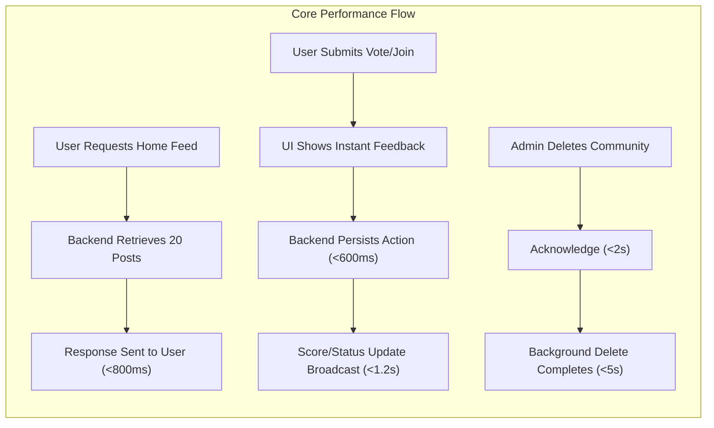

# Performance Requirements for Community Platform

## Performance Principles
THE Community Platform SHALL provide consistently responsive, reliable, and scalable experiences for all users, with performance characterized by:
- Immediate perceived feedback for interactive actions
- Predictable system response times
- Robust handling of concurrent users and bursts of activity (e.g., voting storms, comment surges)

THE platform SHALL prioritize essential business functions, including post submission, voting, commenting, community joining/leaving, and browsing, to always meet minimum performance baselines regardless of user load.

## Response Time Expectations

### Core User Interactions
- WHEN a user loads the main home feed (20 posts), THE platform SHALL respond within 800ms under typical conditions (normal load up to 90th percentile).
- WHEN a user requests “Load more” for posts or comments, THE platform SHALL retrieve the next page within 1.2 seconds in 95% of cases.
- WHEN viewing the detail for a post (including top-level comments), THE platform SHALL serve all content within 1 second (excluding network latency).
- WHEN a user submits a new post, comment, upvote/downvote, or join/leave action, THE platform SHALL display result UI (including optimistic updates) instantly, and the backend SHALL confirm persistence within 600ms for 95% of transactions.
- WHEN a guest user loads the platform landing page, THE system SHALL present visible content (above-the-fold, 10 posts minimum) in under 600ms after initial request.

### Administrative & Exceptional Interactions
- WHEN an admin deletes a sub-community or post (bulk action: up to 10,000 items), THE system SHALL acknowledge the request within 2 seconds and complete deletion in the background if necessary, guaranteeing eventual consistency within 5 seconds.

### Error Cases and User Messaging
- IF backend cannot meet the above response times for an action, THEN THE platform SHALL immediately display a loading spinner or explanatory message ("A temporary error occurred. Please try again in a moment."), and allow seamless retry within the UI.

## Load and Throughput

- THE Community Platform SHALL support a baseline of 10,000 concurrent users, each actively browsing and engaging in core actions.
- WHEN subjected to peak demand (e.g., media-driven surge or trending post), THE system SHALL handle at least 600 new post submissions, 8,000 comments, and 20,000 votes per minute with degradation only affecting non-core features (e.g., background tasks, analytics).
- THE platform SHALL maintain voting and join/leave status consistency within 1.2 seconds of user interaction for all other users viewing the same resource.
- THE system SHALL be horizontally scalable to accommodate growth without requiring architectural rewriting.

## Pagination and Search Performance

- THE platform SHALL paginate all main feeds (posts, comments, community grids) in blocks of 20 items, with “Load more” always available at the bottom when more items exist.
- THE "Global Latest" section in the right sidebar SHALL always deliver the 10 most recent posts in under 500ms.
- WHEN a search query (including communities, posts, comments) matches at least one result, THE system SHALL return the first page (20 results) within 1 second in 95% of cases.
- IF a query returns no matches or is under 2 characters, THEN THE platform SHALL display a response instantly (<200ms average), including appropriate guidance.
- WHERE a feed or search spans more than 500 total items, THE system SHALL maintain page retrieval times under 1.5 seconds for any page up to the 5,000th item.

## Data Consistency Requirements

- WHEN a user joins or leaves a community, THE updated membership and "Recent Communities" list SHALL be reflected instantly in their own session, and in all other user feeds within 1.2 seconds (eventual consistency guarantee).
- WHEN a post, comment, or vote is created, edited, or deleted, THE associated counts and scores SHALL update for all users viewing the affected resource within 1.2 seconds.
- THE platform SHALL enforce transactional consistency for critical operations: joining/leaving, voting, post/comment creation/deletion, sub-community creation.
- WHERE eventual consistency is used (e.g., analytics, delayed deletions), THE system SHALL clearly indicate processing state to users (e.g., spinner, status message), and SHALL guarantee final consistency within 5 seconds.

## Success Metrics

| Metric                           | Target Value                          |
|----------------------------------|---------------------------------------|
| Home Feed Response (20 posts)    | < 800ms (90th percentile)             |
| “Load more” Response             | < 1.2s (95th percentile)              |
| Post Detail (with comments)      | < 1.0s (90th percentile)              |
| Vote/Join Persistence Confirmed  | < 600ms (95th percentile)             |
| Search First Page                | < 1.0s (95th percentile)              |
| Global Latest (Sidebar)          | < 500ms                               |
| Membership/Score Consistency     | < 1.2s propagation (global)           |
| Bulk Admin Deletion Acknowledged | < 2s for up to 10,000 items           |
| Eventual Consistency Guarantee   | < 5s on all eventual operations       |
| Platform Concurrency Supported   | >10,000 active users                  |

## Edge Cases and Exception Handling

- IF a sudden influx ("spike") of concurrent users (>50,000) causes response times to exceed targets, THEN THE system SHALL shed non-critical load (e.g., deprioritize irrelevant background tasks) and maintain core interactive functions at baseline.
- IF underlying infrastructure degrades and persistence is temporarily unavailable, THEN THE frontend SHALL reflect a transient error and continue local optimistic updates, offering the user a retry option upon recovery.
- WHEN network latency is abnormally high, THE system SHALL prefetch key data (home feed, community info) when possible after initial login to minimize visible delays.

## Diagrams

---

> *Developer Note: This document defines business requirements only. All technical implementations (architecture, APIs, database design, etc.) are at the discretion of the development team.*