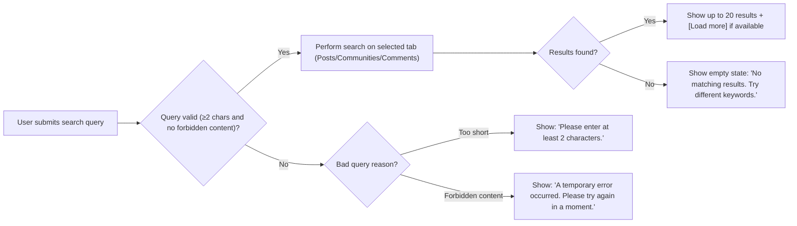

# Community Platform — Search and Discovery Requirements

## 1. Introduction

Search and discovery is a critical element of the communityPlatform service. The business logic specifies full-text search for posts, sub-communities, and comments, open to all users, with interactive actions (post, comment, vote, join) reserved for authenticated users. The requirements below define all business rules, role-specific behaviors, workflows, validations, and error handling for a consistent, testable implementation by backend developers.

## 2. Search Feature Requirements

### 2.1 Searchable Entities
- THE system SHALL enable searching for posts (title/body), sub-communities (name/title), and comments (content) as discrete entities.

### 2.2 Search Modes and Access Rules
- THE system SHALL enable any user, including guests, to perform searches and browse results.
- THE system SHALL restrict posting, voting, joining, and commenting actions linked from search results to authenticated users; WHEN a guest attempts these actions, THE system SHALL prompt for login and resume the action after authentication.
- THE system SHALL present three primary search modes with UI tabs: [Posts], [Sub-Communities], [Comments], defaulting to [Posts] when the search view loads.

### 2.3 Search Pathways
- WHEN a user selects the search flow, THE system SHALL present a unified search field and result tabs, and SHALL update results to match the selected entity (Post/Community/Comment) after each user action (search string edit, tab switch, sort toggle, [Load more]).

### 2.4 EARS Feature Requirements
- WHEN a search query is at least 2 characters long, THE system SHALL validate, trim whitespace, and perform the search on the selected entity.
- WHEN a search query is submitted with fewer than 2 characters, THEN THE system SHALL block the search and show: “Please enter at least 2 characters.”
- WHEN a query contains forbidden content (scripts/code), THEN THE system SHALL reject the search and show: “A temporary error occurred. Please try again in a moment.”
- WHEN switching search tabs, THE system SHALL update the results for the active tab using the current query and sort order.
- WHEN no results are found for a compliant query, THE system SHALL present: “No matching results. Try different keywords.”

### 2.5 Permissions

| Feature                | guest | member | admin |
|------------------------|-------|--------|-------|
| Perform search         |  ✅   |   ✅   |  ✅   |
| View results           |  ✅   |   ✅   |  ✅   |
| Interact with results  |  ❌   |   ✅   |  ✅   |
| View deleted/hidden    |  ❌   |   ❌   |  ✅   |

- WHEN a user is not authenticated, THE system SHALL show search but restrict all interactive actions and show the login prompt if attempted.

## 3. Query Validation Rules

### 3.1 Global Validation
- WHEN a user submits a search, THE system SHALL trim whitespace and process the query.
- IF the query length is <2 characters after trimming, THEN THE system SHALL reject the search and display: “Please enter at least 2 characters.”
- IF forbidden code/script content is present, THEN THE system SHALL block the search and show: “A temporary error occurred. Please try again in a moment.”

### 3.2 Post Search
- THE system SHALL search posts by matching words (tokenized) found in title or body.
- THE system SHALL enforce plain text search only; code/scripts are ignored or trigger the temporary error.
- THE system SHALL match partial and complete words, case-insensitive.

### 3.3 Community Search
- THE system SHALL allow searching by community name (alphanumeric, hyphen, underscore) and/or display title, case-insensitive.
- THE system SHALL provide sort orders: [Name Match] (default; closest match first, ties by latest creation time), [Recently Created] (most recent first).

### 3.4 Comment Search
- THE system SHALL search comment content with [Newest] as the only sort option.

## 4. Result Presentation and Pagination

### 4.1 Sorting
- Post and comment searches SHALL allow [Newest] and [Top] sorts. Default for posts/comments is [Newest].
- Community searches SHALL default to [Name Match] with [Recently Created] available.
- [Newest]: Order by most recent creation time; tiebreaker: larger identifier.
- [Top]: Order by highest score; tiebreakers: creation time, identifier.

### 4.2 Pagination
- THE system SHALL show 20 results per query per page/tab; [Load more] triggers fetch next 20.
- For community search, result cards SHALL show membership state via a contextual [Join] or [Joined] button.

### 4.3 Display and Feedback
- WHEN a user searches with insufficient length, THE system SHALL show: “Please enter at least 2 characters.”
- WHEN no results found for valid query, THE system SHALL show: “No matching results. Try different keywords.”
- Result fields for posts: community name, title, excerpt (up to 2 lines, ellipsis where needed), author, relative time, comment count, score (upvotes–downvotes).
- Result fields for sub-communities: name, description (max 2 lines), logo (if any), [Join|Joined] state.
- For comments: snippet (up to 2 lines), author, relative time, parent post title with link, and community name.
- All time display SHALL use the user’s local timezone and relative formatting; numbers SHALL abbreviate per platform rules (1.2k, 12.3k, 1.2m, etc.).

### 4.4 Error and Edge Cases
- IF a search is attempted with forbidden input (e.g., script/code), THEN THE system SHALL block and show the temporary error.
- IF system/network error prevents search response, THEN THE system SHALL show: “A temporary error occurred. Please try again in a moment.”
- IF user requests out-of-range pagination (too high page number), THEN THE system SHALL show: "No matching results. Try different keywords." and not load further.

## 5. Business Scenarios and User Flows
- WHEN a user searches for a post, THE system SHALL display matching post cards sorted per user’s selected order, 20 per page, with a [Load more] button.
- WHEN a user searches for or explores sub-communities, THE system SHALL present results matching name/title/category, filterable by category, and display join/joined state based on user membership.
- WHEN a user searches for comments, THE system SHALL present snippets with parent post and community link, author, and sort by [Newest].
- IF no results are found, THE system SHALL display the defined empty-state message.
- IF query is too short, THE system SHALL display the query-minimum message and not perform search.
- WHEN more than 20 results are available, THE system SHALL allow repeated [Load more] interactions until all results are loaded or end is reached.
- WHEN interacting with search-linked results (e.g., replying, joining, voting), THE system SHALL enforce all relevant authentication and permission rules, and prompt for login as needed.

## 6. Mermaid Diagram — Search Flow

## 7. Acceptance Criteria
- All queries, sorting, pagination, display, and error handling SHALL follow the rules given; all copy SHALL match platform standard.
- All role-specific restrictions and flows (guest/member/admin) are enforced per table above.
- All workflow and edge-case behavior presented in business processes are testable according to requirements herein.

## 8. Related Documents

- [Functional Requirements Document](./04-functional-requirements.md)
- [Business Rules Guide](./05-business-rules.md)
- [Non-Functional Requirements](./07-nonfunctional-requirements.md)
- [Error Handling and Recovery](./06-error-handling.md)
- [User Roles and Permissions](./02-user-roles-and-permissions.md)
