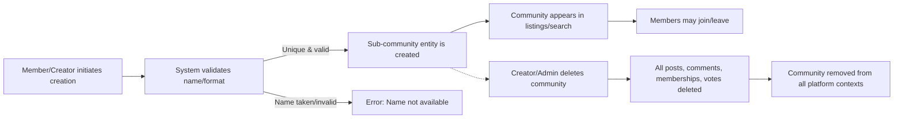
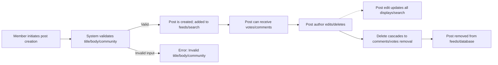
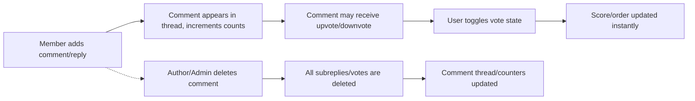
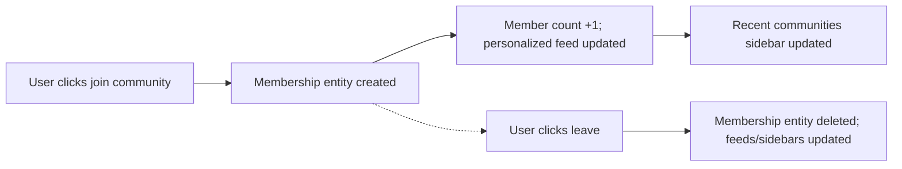

# Dataflow and Information Lifecycle for Community Platform

## 1. 정보 흐름 개요

THE communityPlatform SHALL enable seamless movement of key business entities (sub-communities, posts, comments, votes, users, and memberships) according to all business rules, permission constraints, and event-driven requirements.

- WHEN a user initiates any major business action (e.g., join, post, vote), THE system SHALL update the relevant entities’ state and all associated data flows (e.g., feed inclusion, notification triggers, user activity lists) across the platform in real time or near real time.
- THE entire lifecycle for each entity SHALL be orchestrated based solely on user business events, respecting permissions and validation rules at every stage.

## 2. 엔터티 생애주기 단계

### Sub-Community Entity
- Creation: WHEN a member creates a sub-community with valid name/description/category, THE system SHALL instantiate the sub-community as active and include it in all community lists.
- Update: WHEN the creator edits metadata (description/logo/banner/rules), THE system SHALL replace the corresponding fields for the entity.
- Deletion: WHEN a sub-community is deleted (by creator or admin), THE system SHALL irreversibly remove the sub-community, its posts, comments, votes, memberships, and associated references in all feeds, searches, and sidebars.
- Membership: WHEN a user joins or leaves, THE system SHALL immediately update the member count, the user’s joined communities list, and any affected personalized feeds.

### Post Entity
- Creation: WHEN a member or admin creates a post with proper title, body, and target sub-community, THE system SHALL add it to the sub-community's post list and insert it into all relevant feeds (joined communities/home, right sidebar global latest, etc.).
- Update: WHEN the post author edits the post, THE system SHALL update the title/body subject to validation rules and update affected display feeds in real time.
- Deletion: WHEN a post is deleted (by author or admin), THE system SHALL remove the post and all associated comments and votes from all feeds, community lists, and side references.
- Voting: WHEN a user votes on a post (upvote/downvote/none), THE system SHALL update the post's score and recalculate sort orders and feed positions as needed.

### Comment Entity
- Creation: WHEN a logged-in user adds a comment/reply to an existing post or another comment, THE system SHALL create the comment and insert it at the proper location in the thread and increment comment counts throughout the ancestors' chain.
- Update: WHEN the author edits the comment, THE system SHALL update the comment content and update any immediate display or cached search snippets.
- Deletion: WHEN a comment is deleted (by author or admin), THE system SHALL remove the comment and its children from the thread, update comment counts, and remove any associated votes.
- Voting: WHEN a user votes on a comment, THE system SHALL update the comment's score and adjust sort orders accordingly.

### Membership Entity (User-Community Joining)
- Creation: WHEN a user joins a community, THE system SHALL create a membership entity, update the member count, include the community in the user's personalized feed and recent communities list, and adjust join/leave UI states instantly.
- Removal: WHEN a user leaves, THE system SHALL delete the membership entity and update all related structures (feeds, sidebars, member count) accordingly.

### Voting Entity
- State: For every post/comment, THE system SHALL maintain at most one vote per user per target at a time (upvote, downvote, or none).
- Creation/Toggle: WHEN a user upvotes or downvotes, THE system SHALL update the vote state, adjust the score, and synchronize it with the UI optimistically.

### User Session and Identity
- Login: WHEN a user logs in, THE system SHALL create/refresh a session and grant access to all login-required flows and personalized data.
- Expiry: WHEN a session expires, THE system SHALL prompt for re-login and, after successful authentication, resume the interrupted action/business flow without data loss.

## 3. 이벤트 기반 비즈니스 프로세스

### Sub-Community Lifecycle
- User initiates creation > system validates uniqueness/format > entity created > community appears in listings, searchable, joinable.
- Deletion by creator/admin > cascade removal > all related posts/comments/memberships/votes purged > home and listings updated.
    
### Post Lifecycle
- Member creates post > system validates and adds to sub-community, feeds, sidebars.
- Edit triggers immediate update in all views/discovery/search indexes.
- Delete triggers removal from all lists, cascades to remove comments and votes.
- Voting updates score and reorder feeds instantly by sort rules.

### Comment Lifecycle
- User adds/replies to comment > updates post/thread structure, increments counts.
- Edit updates comment content/context.
- Delete erases subtree, decrements all parent counts, removes votes on deleted subthreads.
- Voting adjusts individual comment scores and list orders.

### Voting Journey
- Each post/comment is always in one of three vote states per user: none, upvote, downvote.
- Changes propagate to UI and backend in real time; score recalculation and sort order update is instantaneous for all affected displays.

### User Membership Flow
- Join action causes instant updates on member count, home feed personalization, recent communities sidebars.
- Leave action undoes above, removing community posts from personalized views.

### Sorting, Feeds, Search
- WHEN a post/comment/vote happens, THE system SHALL update all relevant feeds/lists for sort order (newest/top) and pagination as per business rules.
- Search indexes are updated in real time or near real time as content entities mutate.
- WHEN a user visits Home without joined communities, THE system SHALL default to global top/newest content and encourage exploration.

### Session and Authorization Events
- Session initiates on login and persists for a “generously long” time.
- On session expiry, system triggers re-login modal without disrupting current page/context, retaining unsaved actions.

### Error/Edge Cases
- IF a user action is invalid (e.g., voting on their own content, posting without joining/logging in), THEN THE system SHALL block the action and respond with the appropriate standard message as per [Error Handling Guide](./06-error-handling.md) and [Functional Requirements Document](./04-functional-requirements.md).
- Deletion of communities/posts/comments triggers cascade deletions ensuring referential and business integrity is always preserved.

## 4. Mermaid Diagrams

### Mermaid — Sub-Community Lifecycle

### Mermaid — Post Lifecycle

### Mermaid — Comment and Voting Lifecycle

### Mermaid — User Membership & Feed Personalization

## 5. Summary Table of Key Business Events and Information Flow

| Event | Trigger | System Processing | Cascade/Result |
|-------|---------|------------------|----------------|
| Community Creation | Member submits valid details | Validate, instantiate entity | Appears in listings, joinable |
| Community Deletion | Creator/admin deletes | Remove entity, all dependencies | Purge from feeds, search, sidebars |
| Post Creation | Valid submission | Validate, store, add to feeds | Visible sitewide, searchable |
| Post Deletion | Author/admin deletes | Remove, cascade to sub-entities | Remove post, comments, votes |
| Comment Add | User submits valid comment | Validate, attach in thread | Increment counts, visible instantly |
| Comment Deletion | Author/admin deletes | Remove, cascade subcomments/votes | Thread/counters update |
| Voting | User toggles vote on post/comment | Store new vote state | Score/feed/order recalculation |
| Membership | User joins/leaves | Update membership, feeds, counters | Personalization changes |
| Login | User authenticates | Create session JWT| Enable all actions, personalize data |
| Session Expiry | Session timeout | Prompt re-login, retain context | Restore session/action after|
| Error Events | Invalid operation | Block and inform via standard message | Recovery as per error docs |

## 6. References to Related Documents
- See [기능 명세서](./04-functional-requirements.md) for exhaustive feature details.
- Refer to [비즈니스 규칙 문서](./05-business-rules.md) for cross-entity logic and constraints.
- Edge-case and error recovery flows are specified in the [에러 핸들링 가이드](./06-error-handling.md).
- User roles and session details are in [사용자 역할 및 권한 관리 명세](./02-user-roles-and-permissions.md).

---

