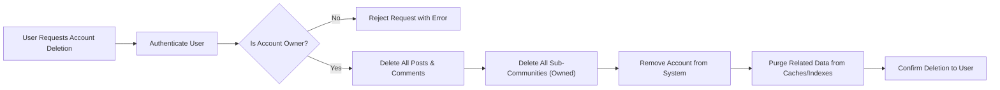

# Security and Compliance Business Logic Requirements

## Privacy Requirements

THE communityPlatform service SHALL respect the privacy of all users through the following business requirements:

- THE system SHALL allow anyone to browse, read, and search public communities and posts without requiring registration.
- THE system SHALL require login for any action that persists data or reflects user identity (posting, commenting, voting, joining/leaving/join-status, or creating a sub-community).
- THE system SHALL ensure that publicly visible data does not expose private user information other than the chosen display name (or 'Anonymous') and content timestamps in user-local time.
- THE system SHALL store user-selected display names for posts/comments, but IF no display name is provided, THEN THE system SHALL present the author as 'Anonymous'.
- THE system SHALL not expose a memberUser’s email, authentication identifier, or IP address to other users at any time.
- THE system SHALL allow users to view a summary of their personal data (all authored posts, comments, joined communities, and display name usage).

## Account and Content Ownership

- THE system SHALL associate all user-generated posts, comments, and sub-communities with the account that created them.
- WHEN a memberUser or adminUser creates a post or comment, THE system SHALL record the ownership as that user’s account identifier.
- WHEN a user requests deletion of their post or comment, THE system SHALL permanently remove that content from the platform.
- WHEN a user account is deleted for any reason, THE system SHALL permanently delete all posts, comments, and sub-communities owned by that account (including any posts inside sub-communities they created).
- WHEN a sub-community is deleted by the owner or adminUser, THE system SHALL permanently delete all posts and content within that sub-community.
- IF a guestUser attempts to perform any content creation, voting, or edit/delete actions, THEN THE system SHALL deny the request and return a 'Login required' error message.
- THE system SHALL enforce that only the original author of a post/comment or an adminUser may delete or edit that post/comment.

## Data Protection

### User Data
- THE system SHALL require strong passwords for new registrations and store password hashes using industry-standard cryptographic methods.
- THE system SHALL never return hashed passwords in any response or to any external party.
- THE system SHALL permit authenticated users to change or reset their password through secure flows.
- WHEN a session expires, THE system SHALL prompt for re-login without exposing any residual user data.
- THE system SHALL use encrypted storage for all sensitive user data, including authentication tokens and email addresses.
- THE system SHALL not rely solely on client-side storage for authentication or session management; all stateful operations must be validated server-side.

### Content Data
- THE system SHALL restrict all edit/delete operations on posts and comments to the original author or adminUser only.
- THE system SHALL require adminUser confirmation (with clear warning) before performing any irreversible actions (user ban, community deletion, etc.).
- THE system SHALL always remove all user-authored content from all caches and indexes within 1 hour of deletion.
- Email addresses and authentication identifiers SHALL never be used in public URLs or logs.

## Compliance Considerations

- THE system SHALL support user data deletion/search/rectification requests in line with global privacy best practices (e.g., GDPR-like, CCPA-like functionality), even if not legally required in all jurisdictions.
- THE system SHALL provide a clear privacy notice / policy accessible from all major pages.
- WHEN a user submits a data portability request, THE system SHALL provide all posts, comments, and joined community membership info associated with that account in a common export format (e.g., CSV or JSON).
- THE system SHALL store audit logs of all administrative actions (bans, deletion by adminUser, data exports) for 1 year; these logs SHALL be accessible only by adminUser.
- IF the user is a minor based on self-reported age or regional requirements, THEN THE system SHALL block creation of an account and explain that underage accounts are not allowed.
- THE system SHALL never explain or expose internal system failures with stack traces or raw error dumps in end-user responses for privacy and security reasons.

## Error Handling for Security and Compliance

- IF a user attempts to access, edit, or delete content they do not own (and are not adminUser), THEN THE system SHALL deny access and return the message: 'You can edit or delete only items you authored.'
- IF a user attempts to perform an action requiring login without an active session, THEN THE system SHALL deny with: 'Please sign in to continue.'
- IF a new registration attempt uses a weak or obviously insecure password, THEN THE system SHALL deny with a message: 'Password does not meet security requirements.'
- IF an account is identified as underage or invalid during registration, THEN THE system SHALL reject registration and explain the age restriction.
- WHEN an adminUser performs destructive actions (e.g., banning or deleting a user/community), THE system SHALL provide confirmation and require explicit acknowledgment before proceeding.
- THE system SHALL log all failed authentication and authorization attempts for analysis but SHALL not reveal the existence/absence of any account in user-facing responses.

## Success Criteria

- All personal user data are only accessible to their respective account and authorized system administrators.
- No personally identifiable information (PII) is ever shown publicly except optional display name.
- Content and user data deletions are processed permanently and are not visible or recoverable by any end-user beyond permitted audit trail by adminUser.
- The platform provides clear notifications about its privacy practices, user rights, and how to exercise those rights.
- The system never exposes technical, internal errors or sensitive details to end users in error messages.

## Mermaid Diagram: Content Deletion Flow

For further business rules on permissions and data handling, refer to the [User Roles and Authentication Requirements](./02-user-roles-and-authentication.md) and [Business Rules and Validation Requirements](./11-business-rules-and-validation.md).
