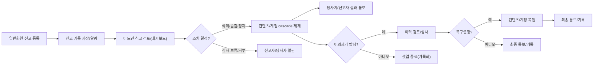

# 어드민 및 모더레이션 비즈니스 요구사항

## 1. 관리 역할 정의 및 권한 경계

### 1.1 권한 수준 및 구분
- 어드민(관리자)은 전체 시스템에 대한 모든 컨텐츠(커뮤니티, 게시글, 댓글)와 사용자 계정에 관해 최고 권한을 가진다.
- 일반 회원은 본인이 소유한 게시글/댓글/커뮤니티만을 관리(수정/삭제)할 수 있으며, 타인의 컨텐츠 및 계정에는 권한이 없다.
- WHEN 어드민이 특정 컨텐츠(게시글/댓글/커뮤니티)를 삭제/수정할 경우, THE 시스템 SHALL 해당 컨텐츠의 소유자인 회원 및 이해관계자(작성자, 속한 커뮤니티 멤버)에게 즉시 통보한다.
- WHEN 일반 회원이 소유하지 않은 컨텐츠/계정/커뮤니티에 대해 삭제/편집을 시도할 경우, THE 시스템 SHALL 동작을 거부하고 무권한 에러 메시지를 표시한다.
- WHERE 어드민이 중요한 권한(삭제/정지/권한회수) 행사를 요청했을 때 THE 시스템 SHALL 한 번 더 확인을 요청하여 실수 및 과오를 최소화한다.

---

## 2. 핵심 어드민 워크플로우 및 비즈니스 플로우

### 2.1 신고(Flag) 프로세스
- WHEN 일반 회원이 부적절 컨텐츠/스팸/규정위반 행위를 신고하면, THE 시스템 SHALL 해당 신고기록을 즉시 저장하고 어드민 알림/대시보드에 노출한다.
- WHEN 부적절 행위(폭언, 차별, 불법, 도배, 명백한 규정 위반)가 신고되면, THE 시스템 SHALL 어드민이 해당 컨텐츠/계정의 삭제/숨김/정지 등 조치를 직접 선택하도록 한다.
- WHERE 동일 컨텐츠/사용자가 반복적으로 신고되는 경우, THE 시스템 SHALL 우선순위/긴급도 기준으로 어드민 대시보드에서 우선 표출하도록 설계한다.

### 2.2 삭제/숨김/제재 처리 플로우
- WHEN 어드민이 게시글/댓글/커뮤니티/계정을 삭제할 때, THE 시스템 SHALL 해당 엔터티 및 하위 엔터티(게시글→댓글, 커뮤니티→게시글/댓글, 계정→작성 컨텐츠)를 cascade로 즉시 삭제한다.
- WHEN 어드민이 컨텐츠(게시글/댓글/커뮤니티)를 숨김/정지할 경우, THE 시스템 SHALL 해당 항목이 검색/피드/조회 등에서 노출되지 않도록 처리한다.
- WHEN 어드민이 회원 계정을 일시정지/영구정지/제한할 경우, THE 시스템 SHALL 동시 계정의 모든 세션을 종료하고 재로그인이 불가하도록 차단한다.
- WHEN 삭제/숨김/정지 조치가 완료되면, THE 시스템 SHALL 영향받는 회원(작성자 등)에게 표준 메시지(사유 포함)로 통보한다.

### 2.3 권한 오남용/실수 및 이의제기(appeal) 플로우
- WHEN 어드민의 제재/삭제/정지 조치가 실수로 판단되거나 영향을 받은 회원이 이의제기를 요청하면, THE 시스템 SHALL 모든 행위의 이력 및 로그를 보여주고, 이의심사가 가능하도록 한다.
- WHERE 이의신청이 수용되어 복구가 결정되는 경우, THE 시스템 SHALL 원복 가능한 범위 내에서 컨텐츠/계정/권한을 즉시 복구한다.
- WHEN 단일 컨텐츠/계정에 여러 번 겹쳐 신고나 삭제/정지 요청이 이루어진 경우, THE 시스템 SHALL 중복딜레이, 재복구, 일괄처리 등 복잡상황도 처리하도록 한다.

----

## 3. 감사, 로그, 통보, 기록 유지 규칙
- THE 시스템 SHALL 신고, 삭제, 정지, 권한행사, 이의신청 및 처분 각 단계별로 상세 이력(행위자, 시각, 사유, 적용대상, 결과 등)을 비가역적으로 기록한다.
- WHEN 어드민이 민감한 조치(계정정지, 커뮤니티 삭제, 콘텐츠 영구삭제 등)를 시행하거나 해제할 경우, THE 시스템 SHALL 반드시 이유, 일시, 담당자, 조치 결과를 상세히 로깅한다.
- THE 시스템 SHALL 일반 회원, 신고자, 당사자에게 결과 통보(승인/반려/보류/복구 등)를 표준 메시지로 안내한다.
- WHERE 어드민/회원 간 분쟁이 발생하면, THE 시스템 SHALL 양측에 이의/답변/심사 기회를 반드시 부여하고, 결과 시점마다 알림을 보낸다.

----

## 4. Edge-case/복잡상황 대응 및 롤백/회수 플로우
- WHEN 어드민의 실수/과실로 잘못된 제재/삭제가 이루어졌다면, THE 시스템 SHALL 신속히 우선 '임시 복구' 처리 후 이의/심사 절차를 밟을 수 있도록 한다.
- WHERE 신고가 악의적이거나 중복/스팸 또는 시비가 분명할 경우, THE 시스템 SHALL 어드민 대시보드에서 우선순위 순간 하락/자동제외/자동필터를 적용할 수 있도록 한다.
- WHEN 시스템 오류, 예기치 않은 중복 실행, 동시 조치 충돌이 감지되면, THE 시스템 SHALL 한 번의 행위만 승인/실행하며, 나머지는 거부 및 로그기록 후 담당자에게 알림을 보낸다.
- WHERE 관리자간 권한 충돌/겹침이 발생했을 때, THE 시스템 SHALL 최근행위자 우선, 이력검토, 협의, 긴급중단 등 정책적 우선순위 체계로 대응한다.

----

## 5. EARS 요구사항 종합 예시
- WHEN 일반 회원이 신고를 등록하면, THE 시스템 SHALL 어드민 알림/대시보드에 신규 신고를 실시간 반영한다.
- WHEN 어드민이 컨텐츠 삭제/숨김/정지를 결정하면, THE 시스템 SHALL 모든 관련 엔터티에 대해 cascade 삭제/숨김하고, 관련자에게 사유 및 결과를 안내한다.
- WHEN 어드민 권한의 부당한 사용/실수가 의심되거나 이의제기가 접수되면, THE 시스템 SHALL 즉시 이의처리/심사/복구 프로세스를 시작한다.
- WHEN 동일 대상에 대해 중복/연쇄 신고 및 조치가 들어올 경우, THE 시스템 SHALL 우선순위, 병합처리, 로그기록 후 일원화해서 처리한다.
- WHEN 회원 또는 어드민이 이의제기 제출 후 결과를 기다릴 때, THE 시스템 SHALL 처리 단계마다 표준 메시지로 진행상황을 통지한다.
- WHEN 모든 제재/복구/권한 변동이 있을 때, THE 시스템 SHALL 해당 이력, 담당자, 사유, 일시, 결과를 기록화해 언제든 추적/감사 가능하도록 한다.

----

## 6. Mermaid 다이어그램: 신고~제재~이의~복구 종합 플로우

----

## 7. 수용 및 평가 기준
- 모든 어드민 권한행사, 제재, 이력기록, 알림, 이의/복구, 오류/실수/동시처리 등의 케이스가 EARS 및 자연어로 빠짐없이 명시되어야 하며, 중복, 미비, 누락 없는지를 기준으로 평가한다.

