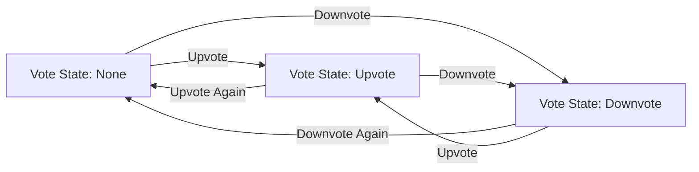
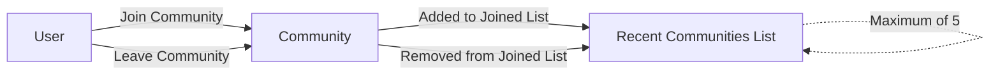

# Business Rules and Validation Requirements

## Summary of Business Rules

The following section comprehensively enumerates all business rules that apply across features, ensuring system-wide consistency, enforcing platform policies, and safeguarding data integrity in the communityPlatform service.

#### Core Business Rules

- THE system SHALL allow any user (guest or authenticated) to freely browse, search, and read posts, communities, and comments.
- WHEN a user attempts an action requiring login (post, comment, vote, join/leave, create/edit/delete communities, etc.), THE system SHALL require authentication.
- WHEN an unauthenticated user attempts a restricted action, THEN THE system SHALL block the action and display the message "Please sign in to continue."
- WHEN a user attempts to edit or delete any post or comment, THE system SHALL permit this action only if the user is the original author; otherwise, it SHALL block and show "You can edit or delete only items you authored."
- THE system SHALL ensure all sub-community, post, and comment deletions by non-admins are limited to those the user created. Admins may delete any content.
- WHEN a user joins or leaves a community, THE system SHALL immediately update that user’s recent communities list and the personalization of the home feed.
- WHEN a community is deleted by its creator or an admin, THE system SHALL also remove all posts and comments within it.
- THE system SHALL implement optimistic UI for all join, vote, and content mutation operations. IF a server sync later fails, THEN THE system SHALL revert to the previous state and display "A temporary error occurred. Please try again in a moment."
- WHEN a session expires (timeout or forced logout), THE system SHALL prompt the user for re-login in a non-disruptive way and, on successful auth, resume the intended action.

## Global Input & Format Constraints

All inputs must conform to strict global criteria to guarantee consistency, reduce errors, and protect system health. Format enforcement and uniqueness validation are critical for sub-communities; length and content validation protect against abuse on posts, comments, and display names.

### Input Validation (EARS Format Examples)
- WHEN a user creates a sub-community, THE system SHALL enforce the name to be 3–32 characters, allow alphanumeric characters, hyphens (-), and underscores (_), and ensure case-insensitive uniqueness.
- IF a user attempts to create a sub-community with an invalid or duplicate name, THEN THE system SHALL block the operation with a message: "This name is already in use." or "This name isn't available. Please choose something simpler."
- WHEN a user provides a description for a community, THE system SHALL allow up to 200 characters; description is optional.
- WHEN a logo or banner is not provided for a community, THE system SHALL display a default image.
- WHEN a user supplies rules for a community, THE system SHALL allow up to 10 rules, each no more than 100 characters, numbering rules automatically.
- WHEN a user inputs a post title, THE system SHALL enforce a length of 5–120 characters (inclusive).
- WHEN a user inputs a post body, THE system SHALL enforce a length of 10–10,000 characters, accept only plain text (no scripts or executable code), allow line breaks, and block prohibited content.
- WHEN a user inputs an author display name, THE system SHALL allow 0–32 characters; IF empty, THEN THE system SHALL use "Anonymous" or an equivalent default string.
- WHEN a user enters a comment, THE system SHALL enforce length between 2–2,000 characters and accept only plain text.
- WHEN a post or comment input exceeds the allowed length or violates prohibited patterns, THEN THE system SHALL block creation or editing and present the appropriate error message.
- WHEN a search query is made, THE system SHALL require at least 2 characters and block otherwise, showing "Please enter at least 2 characters."

### Unique Constraints & Reserved Words

- THE system SHALL enforce sub-community names to be unique regardless of case and reserved word conflicts (e.g., no names matching system routes like 'home', 'login', etc.).
- THE system SHALL prevent any input exploiting reserved routes, system keywords, or exceeding specified maximums.

## Community and Post Validation

Business rules and validation logic specific to sub-communities, memberships, post creation, and post composition ensure member experience quality, feed relevance, and community integrity.

### Community Management Rules (EARS)
- WHEN a sub-community is created, THE system SHALL require a category selection from the predefined list ([Tech & Programming], [Science], [Movies & TV], [Games], [Sports], [Lifestyle & Wellness], [Study & Education], [Art & Design], [Business & Finance], [News & Current Affairs]).
- WHEN an authenticated user creates a new community, THE system SHALL check that the user is not exceeding any system-imposed maximum created sub-communities per user (if any).
- WHEN the creator edits a community, THE system SHALL permit edit of description, logo, banner, and rules only. THE community name remains immutable after creation.
- WHEN a sub-community is deleted, THE system SHALL cascade deletion and permanently remove all associated posts and comments.
- WHEN a user joins a sub-community, THE system SHALL add the community to the user’s joined list, update Recent Communities (max 5, most recent activity), and personalize the home feed.
- WHEN a user leaves a sub-community, THE system SHALL remove posts from that community from the user’s personalized home feed and update Recent Communities accordingly.
- WHEN rendering a community info box, THE system SHALL display member count, description, rules (with numbering), logo/banner (if set), and available actions (Join/Joined, Edit for creator, Delete for creator/admin).

### Post Rules & Validation (EARS)
- WHEN a post is created, edited, or deleted, THE system SHALL allow only the original post’s author (or admin) to perform these actions.
- WHEN a post is composed, THE system SHALL require explicit selection of a valid, existing target sub-community.
- IF a user submits a post without selecting a community, THEN THE system SHALL block and display "Please choose a community to post in."
- WHEN displaying post cards or search results, THE system SHALL render: community name, post title, author (or default display name), relative timestamp (now, X minutes/hours/days ago, in local timezone), comment count, and score (upvotes - downvotes).
- WHEN a post is deleted, THE system SHALL also delete all comments linked to that post.

## Membership and Voting Rules

Membership and voting logic ensure that experience and content rankings remain trustworthy, personalized, and fair for all users.

### Membership Logic (EARS)
- WHEN a user joins or leaves a sub-community, THE system SHALL update their home feed and Recent Communities immediately and sync with the server in the background.
- WHEN a user’s list of Recent Communities exceeds 5, THE system SHALL retain only the 5 most recent, removing the oldest.
- WHEN evaluating content display (home/all feeds), THE system SHALL show posts based on the user’s membership: posts from joined communities for authenticated users, global top/latest posts for guests or users with no memberships.

### Voting & Score Calculation (EARS)
- WHEN a user votes (up or down) on a post or comment, THE system SHALL record only a single voting state per user per item (None | Upvote | Downvote).
- WHEN an upvote or downvote action is performed, THE system SHALL toggle the state (Upvote <-> Downvote) directly. Pressing the same button again reverts to None.
- WHEN calculating score for both posts and comments, THE system SHALL use (upvotes - downvotes).
- IF a user attempts to vote on their own post or comment, THEN THE system SHALL block and display "You can’t vote on your own posts/comments."
- WHEN a user requests sort by Newest, THE system SHALL order by creation time, newest first; for ties, by identifier. WHEN sort by Top, THE system SHALL order by higher score, then recent creation time, then identifier.
- WHEN paginating posts or comments, THE system SHALL return 20 items per page (main feeds) or 10 items (right sidebar Global Latest posts, unpaged).

## Standard Copy, Input, & Display Rules (EARS)
- THE system SHALL display relative timestamps (now, X minutes/hours/days ago) in the user local timezone.
- THE system SHALL abbreviate large numbers (e.g., 1,200 -> 1.2k; 10,000 -> 12.3k; 1,000,000 -> 1.2m) where counts are shown.
- WHEN input or action errors occur, THE system SHALL use these messages:
    - Login required: "Please sign in to continue."
    - No permission: "You can edit or delete only items you authored."
    - Community name taken: "This name is already in use."
    - Invalid community name format: "This name isn’t available. Please choose something simpler."
    - No community selected: "Please choose a community to post in."
    - Query too short: "Please enter at least 2 characters."
    - Self-vote: "You can’t vote on your own posts/comments."
    - Temporary error: "A temporary error occurred. Please try again in a moment."
    
## Visual Reference: Voting State Transition Diagram

## Visual Reference: Community Join/Leave and Recent Communities

---